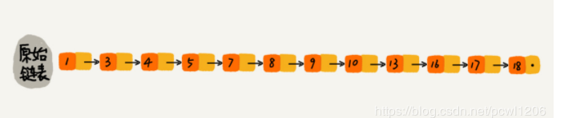
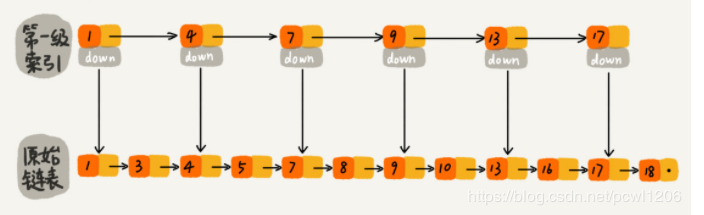
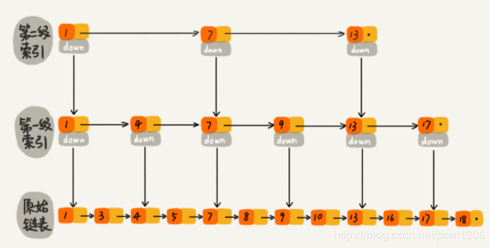
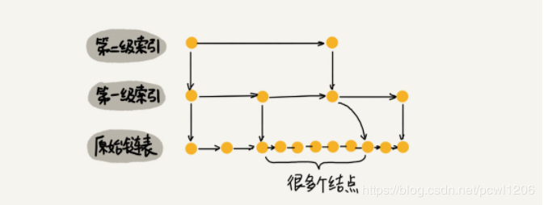
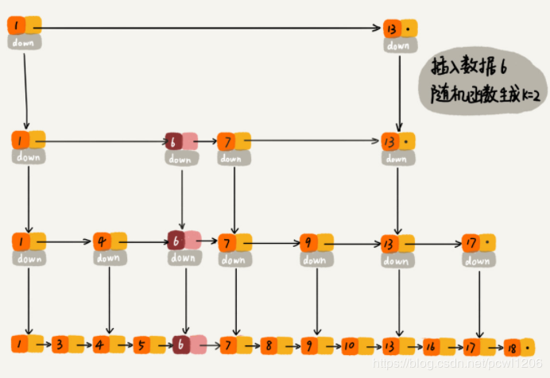

# 跳表(空间换时间)
跳表(SkipList)：增加了向前指针的链表叫做指针。跳表全称叫做跳跃表，简称跳表。跳表是一个随机化的数据结构，实质是一种可以进行二分查找的有序链表。跳表**在原有的有序链表上增加了多级索引**，通过索引来实现快速查询。跳表不仅能提高搜索性能，同时也可以提高插入和删除操作的性能。（性能≈RBTree和AVLTree，在redis和leveldb上有使用）

## 算法分析
以查找13为例，以下面的原始有序单链表形式进行查找，此时至少要经过1-3-4-5-7-8-9-10-13-16共10步检索才能找到16这个值，因此检索的时间复杂度为O(n)。
  
而如果在原始单链表上添加一级索引，此时检索16可以先在一级索引上找到1-4-7-9-13-17，再往下查找可得16，此时只需要7步检索可得结果。  
  
假如再添加一级索引，此时所需的检索量会进一步减少（只需要6步索引）。  
  
### 时间复杂度
索引节点越多，查找效率提高越明显。单链表的索引时间复杂度为O(n)，而跳表的索引时间复杂度分析： 
每两个结点都会抽出一个结点作为上一级索引的结点。那么第一级索引的个数大约就是n/2，第二级的索引大约就是n/4，第三级的索引就是n/8，依次类推，也就是说，第k级索引的结点个数是第k-1级索引的结点个数的1/2，那么第k级的索引结点个数为：$$2/n^{k}$$。   
设索引有h级，最高级的索引有2个结点，通过上面的公式，我们可以得到$$n/(2^{h}) = 2$$，从而可得：$$h = \log_{2}n - 1$$。如果包含原始链表这一层，整个跳表的高度就是$$\log_{2}n$$。我们在跳表中查找某个数据的时候，如果每一层都要遍历m个结点，那么在跳表中查询一个数据的时间复杂度就为：$$O(m*logn)$$。  

### 空间复杂度
假设原始链表的大小为n，那么第一级索引大约有n/2个结点，第二级索引大约有4/n个结点，依次类推，每上升一级索引结点的个数就减少一半，直到剩下最后2个结点，如下图所示，其实就是一个等比数列。
 
这几级索引结点总和为：n/2 + n/4 + n/8 + ... + 8 + 4 + 2 = n - 2。所以跳表的空间复杂度为O(n)。也就是说如果将包含n个结点的单链表构造成跳表，我们需要额外再用接近n个结点的存储空间。

假设每三个结点抽取一个结点到上一级索引中，则第一级需要大约n/3个结点，第二级索引大约需要n/9个结点。每往上一级，索引的结点个数就除以3，为了方便计算，我们假设最高一级的索引结点个数为1
 
总的索引结点大约是：n/3 + n /9 + n/27 + ... + 9 + 3 + 1 = n/2。尽管空间复杂度还是O(n)，但是比之前的每两个结点抽一个结点的索引构建方法，可以减少了一半的索引结点存储空间。

实际上，在软件开发中，我们不必太在意索引占用的额外空间。在讲数据结构的时候，我们习惯性地把要处理的数据看成整数，但是在实际的软件开发中，原始链表中存储的有可能是很大的对象，而索引结点只需要存储关键值和几个指针，并不需要存储对象，所以当对象比索引结点大很多时，那索引占用的额外空间就可以忽略了。

## 跳表插入
插入时间复杂度——O(logN)，和单链表的插入方式类似，只是后续需要加入一个动态索引调整。
## 跳表删除
删除时间复杂度——O(logN)，只是后续需要加入一个动态索引调整。

## 动态索引调整
当在某个索引区间插入过多的节点时，可能会退化为单链表。

可以通过一个随机函数，来决定这个结点插入到哪几级索引层中，比如随机函数生成了值K，那我们就将这个结点添加到第一级到第K级这个K级索引中。如下图中要插入数据为6，K=2的例子：

## 跳表性质
(1) 由很多层结构组成，level是通过一定的概率随机产生的；   
(2) 每一层都是一个有序的链表，默认是升序 ；    
(3) 最底层(Level 1)的链表包含所有元素；    
(4) 如果一个元素出现在Level i 的链表中，则它在Level i 之下的链表也都会出现；    
(5) 每个节点包含两个指针，一个指向同一链表中的下一个元素，一个指向下面一层的元素。    

参考：https://blog.csdn.net/pcwl1206/article/details/83512600

# 哈希表