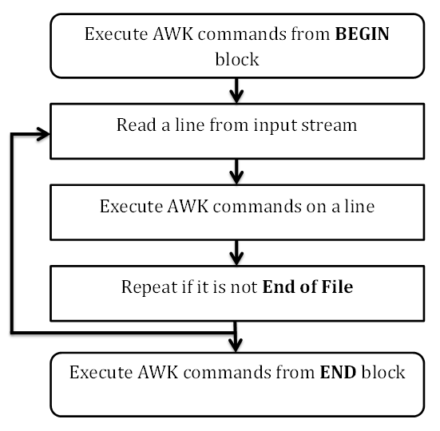

# 常用命令：

[Linux命令大全](http://www.runoob.com/linux/linux-command-manual.html)

export 环境变量名=value ： 环境变量设置，注意 = 两边不能有空格，而且该设置仅在当前打开的 terminal 中有效，要想让这个环境变量在全局中起作用，需要将该指令写入~/.bashrc 文件里面，在 source ~/.bashrc即可

unset 环境变量名 ： 删除该环境变量

env | grep 环境变量名： 输出环境变量名（或含有该环境变量名字符串的其它环境变量名）对应的值

echo $环境变量名 ： 这个$不可省略，打印该环境变量名对应的值

\ 除了作为转义字符之外还可以作为续行符使用，就算命令太长转一行继续编写，可以在当前行键入 \ 后（enter）换行然后进入下一行进行编写


# shell 脚本语法

**一个注意点 shell中 0 为真，非0 为假**

### 读取键盘输入
read var =>  将键盘输入内容写入var中

### 命令代换
注意在shell中，变量赋值： var=value，此时value都会作为一个字符串赋给var，因此如果value是某种有含义的可执行的命令，需要做一些命令代换，从而使得var可以得到命令执行的结果，如下：

date：打印当前时间

直接 DATE=date然后echo $DATE无法打印出当前时间，因为并没有执行date这个命令并赋值个DATE，因此需要使用命令代换

DATA=$(date) 或者 DATA=\`date\`，其中$()这种形式可以实现嵌套

### 单双引号的区别
DATE=date然后echo "$DATE" => 输出当前时间， 而 echo '$DATE' => 输出的是$DATE，即仅含字面意义
### 算术代换

$((var)) 将var转换为数值，因为shell中被赋值的变量其值都是字符串

var=45 echo $(($var+3)) => 输出48
### shell中的通配符：
1. \* 匹配0个或多个任意字符
2. ? 匹配一个任意字符
3. \[若干字符\] 匹配方括号中任意一个字符的一次出现

举例：例如当前目录下有t3.sh文件，此时要找到列出该文件可以：
1. ls \*
2. ls \[abcdeft\]?.sh
3. ls t\[0-2\].sh  此时0-2表示可取0，1，2这三个数字

## 条件测试 可用于 if else if else 逻辑中 （在shell中，0为真，1为假）
var=2 => \[ $var -gt 1 \]  <=> test $var -gt 1

**比较符**：
\[ ARG1 OP ARG2 \] OP 可取形式为：
> -eq 等于 -ne 不等于 -lt 小于 -le 小于等于 -gt 大于 -ge 大于等于

判断是否为文件和是否为目录： \[-d DIR \]  \[ -f FILE \] 

判断字符串的长度是否为0：   \[-z STRING \] \[-n STRING \]

判断两个string是否相同： \[ STRING1=STRING2 \] \[ STRING1!=STRING2 \]
> 特别的，当STRING赋值为空时，如 str2=，str1=hello， 然后执行 \[ str1=str2 \] 此时会报错，因为str2为空（不是空字符串），此时=后面需要带有实际的对象，因此可以使用\[ "str1"="str2" \]，此时在双引号内的"str2"会转换为一个空字符串，即是一个实际的对象，因此可以参与比较。

**因此一个重点在于 好的shell编程习惯应该是总是将变量取值放入双引号中，否则就会出现展开为空对象的情况，对于空对象，shell比较等操作会出现错误**

**逻辑操作符**
\[ !expr ] 非 \[ expr1 -a expr2 ] 与 \[ expr1 -o expr2 ] 或

\[ -d Desktop -a $VAR='abc' ] 同时比较是否为目录和是否变量为'abc'

### shell中的条件逻辑
if \[ 逻辑判断 ]; then ... else ... fi(结束if语句块)， 这里的逻辑判断就是使用前面的**条件测试**操作
> 特殊的 注意 ; 号必须存在； if :; 永远为真，即 if :; then ... fi then后面的语句块总是会被执行； 同时 ... 代表多个语句，每个语句用回车进行分隔即可;

case语句
```shell
read var
case "$var" in 
a|b|c) do something
d) do something
通配符 如 [nN]* 表示以N或n开头，后面跟上任意多个字符) do something
esac # 结束标志

```

### shell中的循环
for循环：注意分割符是空格不是逗号，同时记得有分号结束
```shell
for FRUIT in apple banana peach; then
  do something
done

for filename in `ls -l`; then
  do something
end
```
while循环：
```shell
while [ 条件逻辑 ]; do
  do something
done
```
break 和 continue，break\[n]是指定跳出n层循环（注意**循环是可以嵌套的**），continue是跳出当前循环步

### 位置参数和特殊变量
```shell
$? 上一条命令的exit status，即执行结果
$0 相当于C中的argv[0]，是传入参数的第一个参数
$1 $2 ... 即位置参数，相当于C语言中的argv[1] argv[2] ...
$# 相当于C中的argc，即对应命令行输入多少个参数
$@ 表示参数列表  "$1" "$2" "$3" ...  可以用在for循环的in后面
$* 同上
$$ 当前进程号

位置参数左移  shift => "$1" "$2" "$3" ... 转变成 "$2" "$3" "$4" ...

```

### 常用函数
echo： 参数 -e 解析转义字符 -n 不进行回车换行 echo \[option] content

管道： 将一个命令的输出作为另一个命令的输入

tee 将结果输出到标准输出中，另一个副本输出到相应的文件中
```shell
ls -l | tee a.txt => 此时会把结果输出到terminal上也输出到文件a.txt中
```

重定向： >（输出重定向） >>(追加) <(输入重定向，将stdin的文件描述符重定向到某个文件上)，如下特殊示例：
```shell
cmd < file1 > file2 输入输出重定向，指定输入为file1，然后将执行结果写入file2
cmd < file 2>&1  改变文件描述符2 指向 1
cmd < &fd 将文件描述符作为标准输入
cmd < &- 关闭标准输入
```

shell 中定义函数：无参数列表，无返回值
```shell
fun(){
  do something
}
fun #执行函数
```
shell如何实现传参： 
```shell
fun(){
  echo "$0"
  echo "$1"
  echo "$2"
  echo "$3"
}
fun 1 2 3 #执行函数，后带参数
输出为
bash  <-> $0
1 <-> $1
2 <-> $2
3 <-> $3
```

# shell中常用工具

## shell 正则表达式
[shell中的正则表达式总结](http://man.linuxde.net/docs/shell_regex.html)

**基本正则和拓展正则：** 
> 基本正则的规范在于 ? + {} | () 等字符需要解释为普通字符，要表示特殊含义时需要加 \ 进行转义，当grep命令不加-E参数时表示基本正则匹配；而拓展正则即grep命令时加入-E参数，此时上述的特殊字符不需要转义也具有相应的特殊含义。

## 1、grep
文本搜索工具，使用正则表达式搜索指定文本，并将其中匹配的行打印出来。参数有 -G -E -F，通过参数可以启用egrep（新增更多的正则元字符）和fgrep（不匹配元字符，所有的字母都是单词）功能。

命令使用方式 grep \[option\] pattern files \[option\]

grep -E <=> egrep     grep -F <=> fgrep

其它常见参数
1. -c 仅输出匹配行的计数
2. -i 不区分大小写
3. -h 查询多文件时不显示文件名
4. -l 查询多文件时仅输出包含匹配字符的文件名
5. -n 显示匹配行和行号
6. -s 不显示不存在或无匹配文本的错误信息
7. -v 显示不包含匹配文本的所有行
8. --color=auto  可以为找到的关键词部分加上颜色显示

9. grep -r 递归查找（子目录中也进行查找）
10. grep -r skip 不进行递归查找


## 2、find
根据文件名搜索文件，不打开文件内容。默认递归查找
```shell
find pathname -options [-print -exec -ok ...]
```
1. pathname： 搜索路径
2. -print： 将匹配的文件输出到标准输出
3. -exec：对匹配的文件执行参数给定的shell命令，命令形式为 'command' {} \; {} 和 \; 之间的空格时必需的。 例如
```shell
find . -type f -exec ls -l {} \; 此时输出到terminal中的结果为当前目录下的所有文件，不包括目录
```
4. -ok： 与exec的作用类似，只是利用安全模式执行参数指定的shell命令

其它参数详解： [find 命令详解](http://man.linuxde.net/find)
```shell
-amin<分钟>：查找在指定时间曾被存取过的文件或目录，单位以分钟计算；
-anewer<参考文件或目录>：查找其存取时间较指定文件或目录的存取时间更接近现在的文件或目录；
-atime<24小时数>：查找在指定时间曾被存取过的文件或目录，单位以24小时计算；
-cmin<分钟>：查找在指定时间之时被更改过的文件或目录；
-cnewer<参考文件或目录>查找其更改时间较指定文件或目录的更改时间更接近现在的文件或目录；
-ctime<24小时数>：查找在指定时间之时被更改的文件或目录，单位以24小时计算；
-daystart：从本日开始计算时间；
-depth：从指定目录下最深层的子目录开始查找；
-expty：寻找文件大小为0 Byte的文件，或目录下没有任何子目录或文件的空目录；
-exec<执行指令>：假设find指令的回传值为True，就执行该指令；
-false：将find指令的回传值皆设为False；
-fls<列表文件>：此参数的效果和指定“-ls”参数类似，但会把结果保存为指定的列表文件；
-follow：排除符号连接；
-fprint<列表文件>：此参数的效果和指定“-print”参数类似，但会把结果保存成指定的列表文件；
-fprint0<列表文件>：此参数的效果和指定“-print0”参数类似，但会把结果保存成指定的列表文件；
-fprintf<列表文件><输出格式>：此参数的效果和指定“-printf”参数类似，但会把结果保存成指定的列表文件；
-fstype<文件系统类型>：只寻找该文件系统类型下的文件或目录；
-gid<群组识别码>：查找符合指定之群组识别码的文件或目录；
-group<群组名称>：查找符合指定之群组名称的文件或目录；
-help或——help：在线帮助；
-ilname<范本样式>：此参数的效果和指定“-lname”参数类似，但忽略字符大小写的差别；
-iname<范本样式>：此参数的效果和指定“-name”参数类似，但忽略字符大小写的差别；
-inum<inode编号>：查找符合指定的inode编号的文件或目录；
-ipath<范本样式>：此参数的效果和指定“-path”参数类似，但忽略字符大小写的差别；
-iregex<范本样式>：此参数的效果和指定“-regexe”参数类似，但忽略字符大小写的差别；
-links<连接数目>：查找符合指定的硬连接数目的文件或目录；
-iname<范本样式>：指定字符串作为寻找符号连接的范本样式；
-ls：假设find指令的回传值为Ture，就将文件或目录名称列出到标准输出；
-maxdepth<目录层级>：设置最大目录层级；
-mindepth<目录层级>：设置最小目录层级；
-mmin<分钟>：查找在指定时间曾被更改过的文件或目录，单位以分钟计算；
-mount：此参数的效果和指定“-xdev”相同；
-mtime<24小时数>：查找在指定时间曾被更改过的文件或目录，单位以24小时计算；
-name<范本样式>：指定字符串作为寻找文件或目录的范本样式；
-newer<参考文件或目录>：查找其更改时间较指定文件或目录的更改时间更接近现在的文件或目录；
-nogroup：找出不属于本地主机群组识别码的文件或目录；
-noleaf：不去考虑目录至少需拥有两个硬连接存在；
-nouser：找出不属于本地主机用户识别码的文件或目录（被删除的用户的文件都归属于nouser）；
-ok<执行指令>：此参数的效果和指定“-exec”类似，但在执行指令之前会先询问用户，若回答“y”或“Y”，则放弃执行命令；
-path<范本样式>：指定字符串作为寻找目录的范本样式；
-perm<权限数值>：查找符合指定的权限数值的文件或目录（755 666之类的）；
-print：假设find指令的回传值为Ture，就将文件或目录名称列出到标准输出。格式为每列一个名称，每个名称前皆有“./”字符串；
-print0：假设find指令的回传值为Ture，就将文件或目录名称列出到标准输出。格式为全部的名称皆在同一行；
-printf<输出格式>：假设find指令的回传值为Ture，就将文件或目录名称列出到标准输出。格式可以自行指定；
-prune：不寻找字符串作为寻找文件或目录的范本样式;
-regex<范本样式>：指定字符串作为寻找文件或目录的范本样式；
-size<文件大小>：查找符合指定的文件大小的文件；
-true：将find指令的回传值皆设为True；
-typ<文件类型>：只寻找符合指定的文件类型的文件；
-uid<用户识别码>：查找符合指定的用户识别码的文件或目录；
-used<日数>：查找文件或目录被更改之后在指定时间曾被存取过的文件或目录，单位以日计算；
-user<拥有者名称>：查找符和指定的拥有者名称的文件或目录；
-version或——version：显示版本信息；
-xdev：将范围局限在先行的文件系统中；
-xtype<文件类型>：此参数的效果和指定“-type”参数类似，差别在于它针对符号连接检查。
```


## 3、xargs
find命令找到所有的匹配文件会一次性传递给-exec选项后指定的命令进行操作，此时可能会出现缓冲区溢出的危险，因此可以使用xargs命令来解决类似的问题。find命令将结果传给xargs，此时xargs只会获取一部分文件而非全部，先处理获得的该部分文件，然后再对下一批文件进行处理

```shell
find . -type f -print | xargs vim # 即找到当前目录下的所有文件，然后通过管道传递给xargs，然后用vim顺次打开这个文件
find . -type f -print | xargs grep "hello" # 即找到当前目录下的所有文件，然后通过管道传递给xargs，然后匹配当中含有hello的行并打印
```

## 4、sed命令(比较利于处理行数据)
流编辑器，在shell脚本和makefile文件中作为过滤器使用，即将前一个程序的输出引入sed的输入，经过一系列编辑命令转换为另一种格式输出。sed和vi的末行命令类似（在vi中用:然后敲入的命令）

```shell
sed option 'script'（过滤的正则条件，写入某个脚本文件中） file1 file2 ...（过滤的文件）
sed option -f scriptfile file1 file2 ...
```
一些参数（option）的选择（**一个注意点：sed默认不修改源文件**）:
```shell
--version： 显示版本
--help：提示
-n, --quiet, --silent：静默输出，屏蔽自动打印内容
-e script：允许多个脚本指令被执行
-f script-file --file=script： 从文件中读取脚本指令
-i,--in-place： 直接修改源文件，经脚本指令处理后的内容将被输出到源文件
-l N, --line-length=N：输出行长度（第N行的长度）
--posix： 禁用GNU sed的拓展功能
-r, --regexp-extended： 脚本中使用拓展正则表达式，默认是基础正则表达式
-s, --separate：默认情况下 sed将把命令行指定的多个文件名作为一个长的连续输入流，该参数会修改为分别读取单独文件
-u,--unbuffered：最低限度的缓存输入和输出
```
示例: 假设testfile中有3行，分别是abc，123，456
```shell
sed '/abc/p' testfile => 在testfile中找到abc然后打印出匹配一行
sed "2,3d" testfile | tee ab.txt => 删除testfile中的2-3行，然后保存到ab.txt文件中
```
常用命令：匹配规则
```shell
/pattern/p ： 打印匹配pattern的行
/pattern/d ： 删除匹配pattern的行
/pattern/s/pattern1/pattern2/ 查找符合pattern的行，将该行第一个匹配pattern1的字符串替换为pattern2
/pattern/s/pattern1/pattern2/g 查找符合pattern的行，将该行所有匹配pattern1的字符串替换为pattern2（全局替换）

sed -n '/[a-z].c/p' testfile => 此时会打印出abc
sed 's/bc/-&-/' testfile => 此时第二行的abc会变成 a-bc-，其中&指代和pattern1相互匹配的字符串
sed -r 's/([0-9])([0-9])//-\1-~\2~' testfile => 其中的\1表示和pattern1中第一个()匹配的内容，\2表示和pattern1中第二个()匹配的内容，依此类推

假设文件t.txt中含有如下内容：
<a src="www.abc.com/1/1.jpg">hello world</a>
此时
sed -r 's/<[/ a-z]*>//g' t.txt <=> sed -r 's/<.*?>//g' t.txt 此时可以去除其中的标签，*对应的是出现0次或1次[] 中表示的是出现/ 空格和a-z这些字符
```
其它几个常用命令
```shell
a 追加
i 插入
d 删除
s 替换

sed "2,5d" testfile => 删除testfile中的2-5行
sed "2a itcast" testfile => 在testfile的第二行后添加itcast，a是append，追加
```

## awk（比较利于处理列数据）
awk缺省的行分隔符为换行，缺省的列分隔符为连续空格或tab，awk实际是复杂脚本语言，有循环和分支结构。
```shell
awk option 'script'（过滤的正则条件，写入某个脚本文件中） file1 file2 ...（过滤的文件）
awk option -f scriptfile file1 file2 ...
```
假设testfile中有 ProductA 30、ProductB 76和ProductC 55三列
```shell

/pattern/{actions} => 符合某个pattern执行动作
condition{actions} => 满足何种条件执行动作

awk '{print $2;}' testfile => 打印第二列内容，即30，76，55； 打印第一列使用 $1 即可，可见提取列信息很简单

awk '$2<75 {printf "%s\t%s\n",$0,"REORDER"} $2>=75 {print $0}' testfile # 其中$0表示整个当前行
等价于
awk '{if($2<75) printf "%s\t%s\n",$0,"REORDER"} {if($2>=75) print $0}' testfile
输出为:
  ProductA 30 REORDER
  ProductB 76
  ProductC 55 REORDER

awk '/^ *$/ {x=x+1;} END {printx}' testfile => 匹配空行，同时计算有多少个空行
```
**两个较为特殊的字段：BEGIN 和 END，BEGIN标记在执行文件操作之前完成一些操作的代码块，END标记在执行文件操作之后再完成一些操作的代码块，都写在同一个''之中**  


awk的内建变量（除 $0,$1...之外的常用内建变量）
```shell
FILENAME 当前输入文件的文件名
NR       当前行的行号，只读变量不可修改，例如有3行，print NR 会显示1，2，3
NF       当前行所拥有的变量数，同样不可改，例如每行有3列，共2行，print NF 会显示 3，3
OFS      输出格式的列分隔符 缺省为空格
FS       输入文件的列分隔符 缺省为连续空格或tab
ORS      输出格式的行分隔符 缺省为换行符，下同
RS       输入文件的行分隔符

awk 'BEGIN {FS=":"} {print $1;}' /etc/password => 按照 : 作为分隔符对testfile进行分割，并打印其中的第1列
```
awk流程控制和循环
```shell
for 循环
for (initialisation; condition; increment/decrement) 
    action

do-while循环
do
    action
while (condition)

示例：
awk 'BEGIN { for (i = 1; i <= 5; ++i) print i }' => 打印1~5

-----------------------------------------------------------------------------
if...else... 控制流
if (condition)
{
    action-1
    action-1
    .
    .
    action-n
}

if (condition)
    action-1 => 注意在else之前必须加分号，否则无法分辨
else
    action-2

if (condition1)
    action-1 => 注意在else之前必须加分号，否则无法分辨
else if(condition2)
    action-2 => 注意在else之前必须加分号，否则无法分辨
else
    action-3

示例:
awk 'BEGIN {
a=30;
if (a==10)
  print "a = 10";
else if (a == 20)
  print "a = 20";
else if (a == 30)
  print "a = 30";
}'
```

高级应用：
1. [统计词频](https://blog.csdn.net/u013246898/article/details/80240024)
2. [awk常用命令集合](http://www.runoob.com/linux/linux-comm-awk.html)
3. [awk数组](https://www.jianshu.com/p/64952ccbf733)
4. [awk字符串连接](https://www.cnblogs.com/chengmo/archive/2010/10/09/1846639.html)
5. [awk循环（这个文档还介绍了函数）](http://wiki.jikexueyuan.com/project/awk/loops.html)

