# 基础数据类型
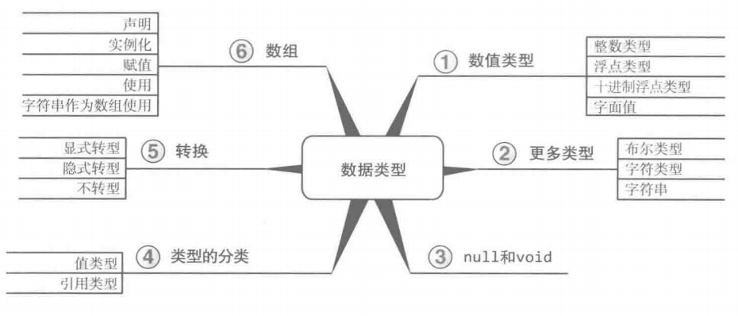

## 数值类型
1、 整数  
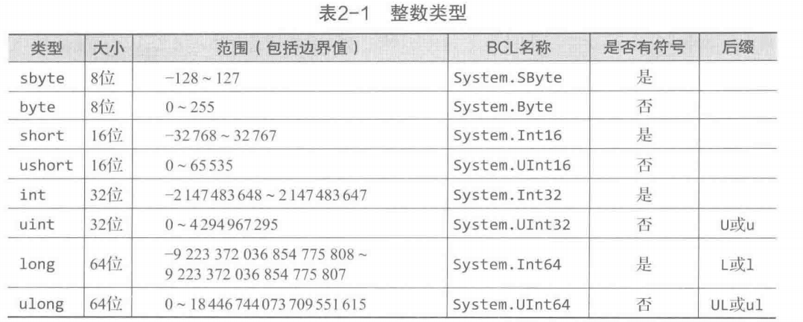
备注：BCL（Base Class Library）中的命名为完整名称

2、浮点数类型-二进制数表示的浮点数形式，可能存在舍入误差  
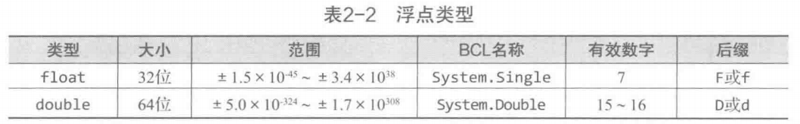

- 十进制浮点类型 - 范围内保证精确  
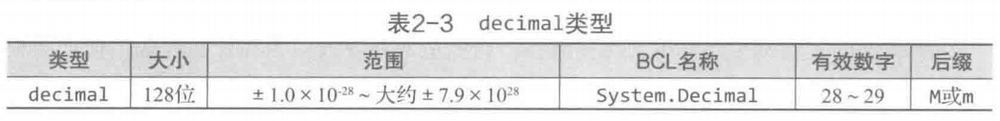

3、字面量 字面值  
表示固定值，如 int a = 2， 2就是一个字面量。  
指数记法： 6e02 = 600  
十六进制计数：0x2A
round-trip格式化：输出到终端时如果数值的长度过长可能会被截断，此时采用round-trip格式化可以处理问题：  
```C#
const double n = 1.618033988749895;
text = string.Format("{0:R}",n); // round-trip格式化
result = double.Parse(text); // 肯定可以得到原数值
```

4、字符串  
- 字面量， 双引号括起。@开头表示字符串中的转义字符不起作用。  

- 插值语法：\$ 开头，string.Format()方法的简写形式    
```C#
System.Console.WriteLine($"Your full name is {firstname} {lastname}";) // firstname, lastname是字符串变量，$开头是必须的。
```  
- 字符串方法：静态方法 和 实例方法
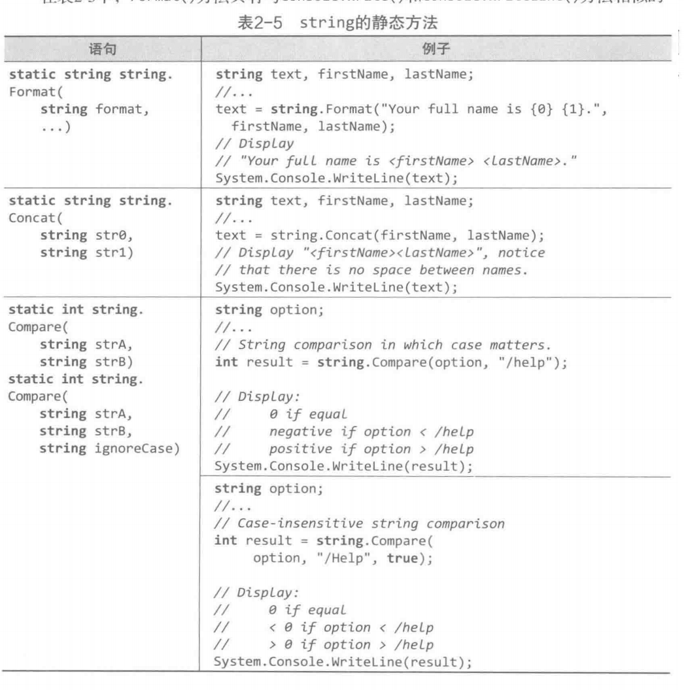
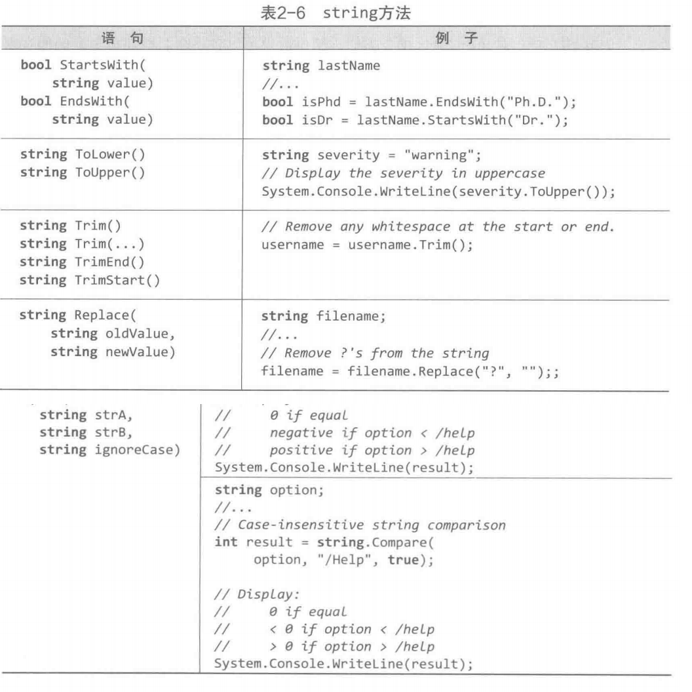

字符串的长度：string.Length  
字符串转大写：text.ToUpper()  
字符串转大写：text.ToLower()

5、null 和 void  
null - 只能赋给引用类型，指针类型和可空值类型

void 参数的类型，返回值的类型，不用返回，无参数等。指定数据类型不传递任何数据。

可空修饰符 - 不能把null赋给值类型，除非用可空修饰符 ?， 如

```C#
int? count = null; 
```

# 值类型和引用类型

###  简介
值类型 —— 具体数值存放在栈，直接包含数值  
引用类型 —— 具体数值存放在堆，包含地址，指向具体的数值（指向堆）  
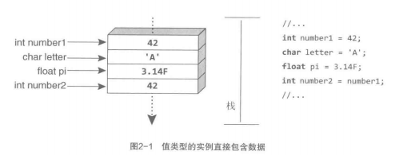
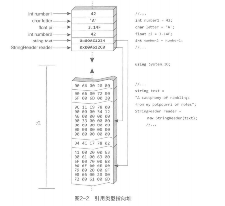


### 数值转换和装箱操作
checked块和unchecked块。checked块会对块中的数据进行检测，如果存在转型而且会有溢出的情况时，会报错。
```C#
checked
{
    int n = int.MaxValue;
    n = n + 1;
    System.Console.WriteLine(n);
}

```

字符串转数值
int.Parse(string), float.Parse(string)  
System.Convert.ToDouble(string), System.Convert.ToBoolean(string)

TryParse(string) => 转换失败不会抛异常，而是返回False

toString(); => 任何类型都有，返回类型的一个字符串表示


### 装箱操作
装箱转换 从值类型转到引用类型。相反过程称为拆箱。   
1 - 在堆上分配内存  
2 - 内存复制，当前存储位置上的值类型数据复制到堆上分配好的位置  
3 - 转换结果即对堆上的新存储位置的引用  
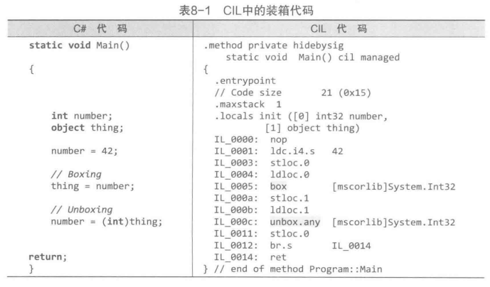  
容易忽略的问题:可变值类型——对应结构体，如下的IAngle方法使得结构体Angle中的值可变，即变成可变值类型。为了避免过度装箱拆箱，需要减少可变值类型的使用。  
值类型变量相当于写了值的纸，装箱操作想当于将这张纸复印一张后放入箱中。同理，拆箱操作相当于从箱中取出纸后复印一张给变量。主要IAngle(ObjectAngle)是引用转换而不是装箱转换。  
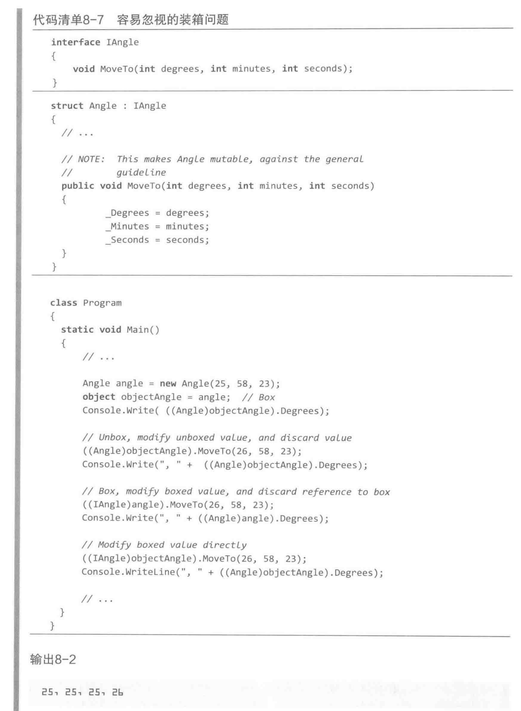

利用接口类型去转换装箱后的值类型（即引用转换）可以有效减少拆箱操作，而且避免上述的可变值类型实际没有改变装箱值的问题。  
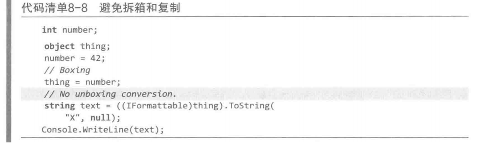

# 数组类型


数组静态方法：  
array.Length => 获取数组长度  
System.Array.Sort(array) => 排序  
System.Array.BinarySearch(array) => 二项查找  
System.Array.clear(array) => 将数组中每一项都设为默认值  
System.Array.Reverse(array) => 数组倒序  
System.Array.Resize(array) => 数组大小重置  