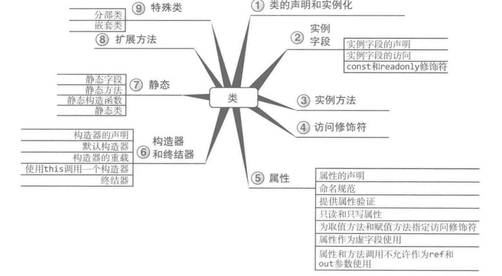
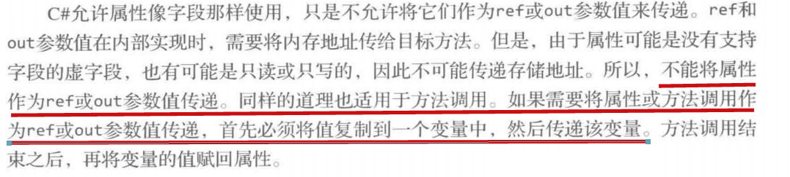
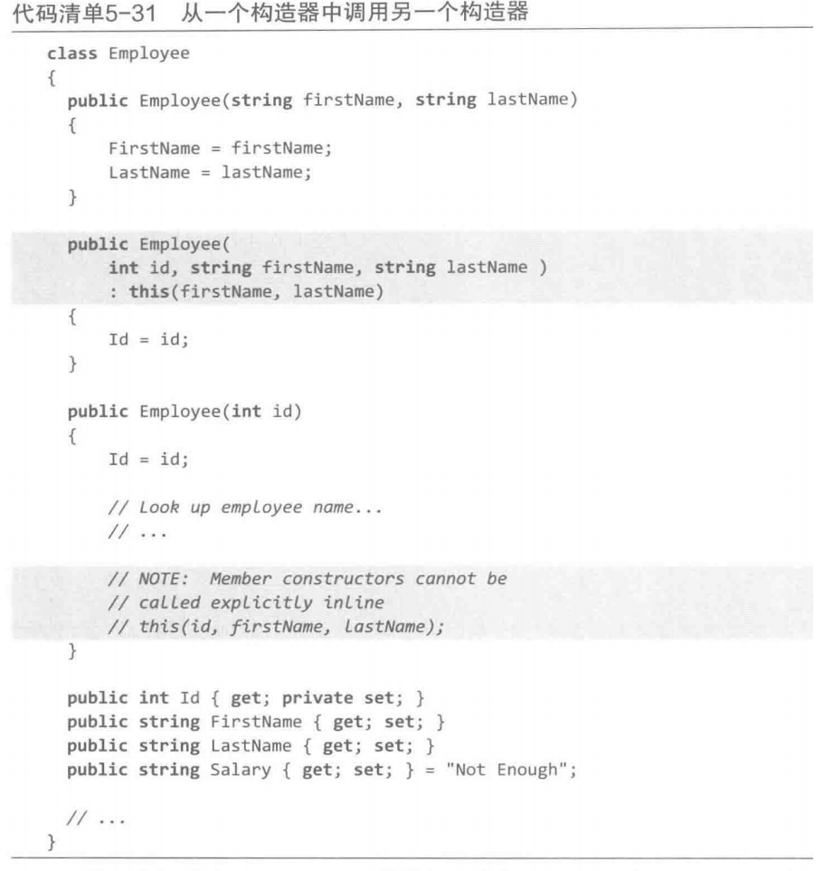
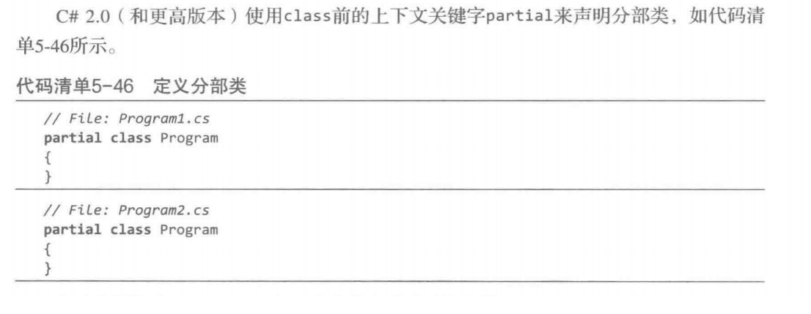
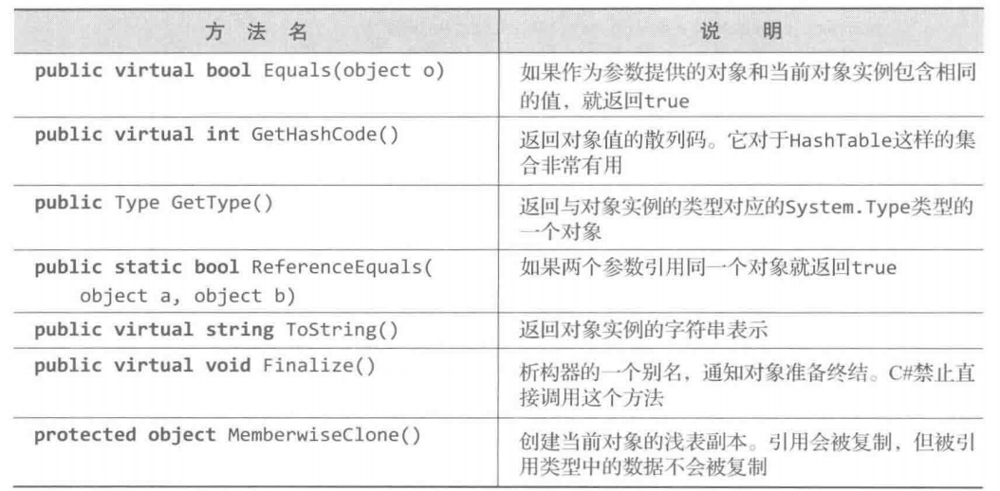
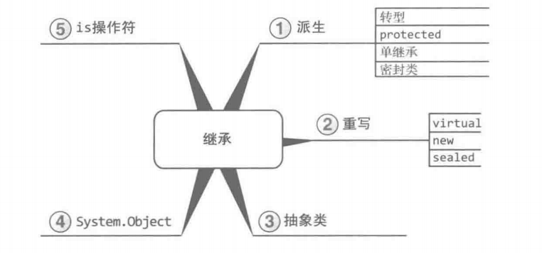
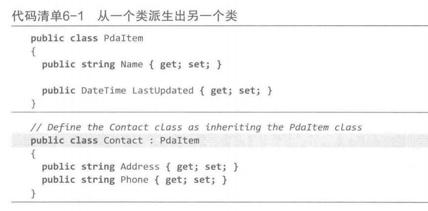
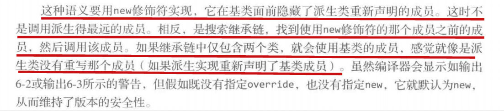
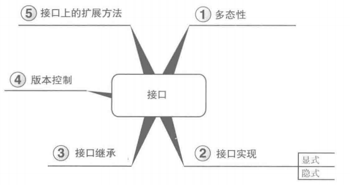
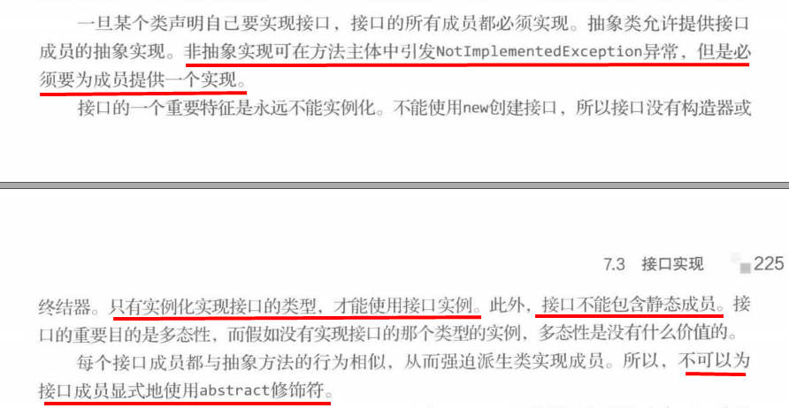

# 类 和 对象


1、this关键字  
显式指出当前访问的字段或方法都是包容类的实例成员，在调用实例成员时this都是隐式的，返回对象本身的实例。  

2、 get set方法实现类属性定义（练习Python的描述符概念和@property）    
```C#
class Person
{
    private string _firstName;
    private string _lastName;

    public string firstName{
        get{
            return _firstName;
        }
        set{
            _firstName = value;
        }
    }
    public string lastName{
        get{
            return _lastName;
        }
        set{
            _lastName = value;
        }
    }

    public string Title{get; set;} // 简化写法，不用指明_Title，而且get和set不用写出具体的程序块（当然如果需要额外处理则仍需写明）
}
```
**注意事项**  


3、对象初始化器
```C#
Employee employee1 = new Employee{Title="***", Salary=999};
```

构造器链：类中的构造器去调用类中的另一个构造器。  


4、静态方法/字段（static）  
多个实例共享的数据

5、静态构造器  
不显式调用，而是在运行时在首次访问类时自动调用静态构造器。**使用场景是将类中的静态数据初始化为特定的值，尤其是无法通过声明一次简单的复制来获取初始值的时候。**

```C#
class Employee
{
    static Employee()
    {
        Random randomGenerator = new Random();
        NextId = randomGenerator.Next(101, 999);
    }

    public static int NextId = 42;
}
```
6、静态类   
不包含任何实例字段，只有静态方法，静态字段和静态属性。  
C# 编译器自动在CIL代码中将静态类标记为abstract或sealed，从而静态类不能派生出子类。

7、拓展方法  
拓展方法可模拟为不同的类创建实例方法，只需修改静态方法的签名，使第一个参数为要拓展的类型，并在类型名称前加上this关键字。  
当类中含有和拓展方法同名的方法时，拓展方法不会得到调用。

拓展方法（作用于基类）可在子类中被使用。

```C#
public static class DirectoryInfoExtension
{
    public static void CopyTo(
        this DirectoryInfo sourceDirector, string target,SearchOption option, string searchPattern
    ){
        //......
    }
}

DirectoryInfo directory = new DirectoryInfo("..");
directory.CopyTo("...",...);
```

8、分布类 和 分布方法 —— 类的定义分布在不同的文件中。分布方法应用于分布类中，分布类中的方法可以在分布类的一部分中声明，在另一个部分明确定义。  
分布方法必须是返回void，而且不能用out作为参数类型。如果需要返回值，可以使用ref类型的参数。  


9、object类（所有类的祖先）




# 继承（只能单继承）

实例如下：  


object类是一切类的基类。

标记为sealed的类（密封类）不能被派生
```C# 
public sealed class A // 标记为sealed
{
    //...
}
```

1、virtual修饰符  
可重写属性和方法，不可重写字段或静态成员。基类中必须将可重写的每个成员用virtual修饰。而在子类中，必须用override修饰可被重写的方法。  

被override重写的方法也会自动成为虚方法，可被子类重写。

```C#
public class PadItem
{
    public virtual string Name{get; set;}
    // ....
}

public Contact : PadItem
{
    public override string Name{
        get{
            //...
        }
        set{
            //...
        }
    }
    // ...
}

```

使用new而不是override修饰虚方法，此时会产生如下效果：


利用base关键字访问基类成员：  


初始化时要顺便对基类进行初始化（调用基类的构造器，假如基类没有默认构造器的话）
```C#

public class Contact : PadItem
{
    public Contact(String name):base(name){
        Name = name;
    }
    public string Name{get;set;}
}
```

2、抽象类 —— abstract关键字，用该关键字声明类，同时注意抽象类的主要特征是抽象类中含有抽象方法（也是用abstract关键字修饰，不能同时使用virtual关键字去修饰），同时注意抽象方法是不具备具体实现的，必须交由子类去实现（子类重写用override关键字去实现）。  
多态的思想： 只有对象本身才知道如何更好地执行特定操作。

3、is操作符——判断对象是否属于某个类 / as 操作符 —— 类型转换
```C#
if(data is object)
{
    // ... ... 
}
```

```C#
data as Document; // 将data对象转为Document类型，如果转换不成功就返回null
```

# 接口
继承确定的是is a 的关系，而接口确定的是can do的关系，即该类的对象能做什么。



接口的特点如下：注意接口中不带字段，可带属性，且属性不引用支持字段（就是没有一个私有字段被属性支持）  




接口成员调用:
- 显式成员实现：将对象转型为接口。
```C#
public class Contact : PadItem, IListable
{
    // ...
    string[] IListable.ColumnValues // 显式指明了是接口的成员
    {
        //....
    }
}
```
- 隐式成员实现：只要求成员为公有成员，且签名和接口成员的签名一致，不需要用override关键字或其它指示符。一般是采用隐式方式实现。

接口可以被继承（单继承和多继承均可），接口的常用法是用于转换类实例为接口实例，这种转换是隐式转换的。

