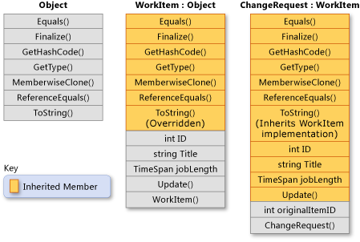

# MSDN 和 C# 图解教程方面关于类和对象的学习

## 类和结构体
类是引用类型，类对象的变量引用该对象在托管堆上的地址。如果将同一类型的第二个对象分配给第一个对象，则两个变量都引用该地址的对象。类对象使用new关键字进行初始化。
```C#
public class Person
{
    public string Name { get; set; }
    public int Age { get; set; }
    public Person(string name, int age)
    {
        Name = name;
        Age = age;
    }
    // Other properties, methods, events...
}

class Program
{
    static void Main()
    {
        Person person1 = new Person("Leopold", 6);
        Console.WriteLine("person1 Name = {0} Age = {1}", person1.Name, person1.Age);

        // Declare new person, assign person1 to it.
        Person person2 = person1;

        // Change the name of person2, and person1 also changes. 体现了对象变量引用地址的特性
        person2.Name = "Molly";
        person2.Age = 16;

        Console.WriteLine("person2 Name = {0} Age = {1}", person2.Name, person2.Age);
        Console.WriteLine("person1 Name = {0} Age = {1}", person1.Name, person1.Age);

        // Keep the console open in debug mode.
        Console.WriteLine("Press any key to exit.");
        Console.ReadKey();

    }
}
/*
    Output:
    person1 Name = Leopold Age = 6
    person2 Name = Molly Age = 16
    person1 Name = Molly Age = 16
*/
```
结构是值类型，因此结构对象的变量具有整个对象的副本。 结构的实例也可以使用 new 运算符来创建，但这不是必需的。
```C#
public struct Person
{
    public string Name;
    public int Age;
    public Person(string name, int age)
    {
        Name = name;
        Age = age;
    }
}

public class Application
{
    static void Main()
    {
        // Create  struct instance and initialize by using "new".
        // Memory is allocated on thread stack.
        Person p1 = new Person("Alex", 9);
        Console.WriteLine("p1 Name = {0} Age = {1}", p1.Name, p1.Age);

        // Create  new struct object. Note that  struct can be initialized
        // without using "new".
        Person p2 = p1;

        // Assign values to p2 members.
        p2.Name = "Spencer";
        p2.Age = 7;
        Console.WriteLine("p2 Name = {0} Age = {1}", p2.Name, p2.Age);

        // p1 values remain unchanged because p2 is  copy.
        Console.WriteLine("p1 Name = {0} Age = {1}", p1.Name, p1.Age);

        // Keep the console open in debug mode.
        Console.WriteLine("Press any key to exit.");
        Console.ReadKey();
    }
}
/*
  Output:
    p1 Name = Alex Age = 9
    p2 Name = Spencer Age = 7
    p1 Name = Alex Age = 9
*/
```
p1 和 p2 的内存在线程堆栈上进行分配。 该内存随声明它的类型或方法一起回收。 这就是在赋值时复制结构的一个原因。 相比之下，当对类实例对象的所有引用都超出范围时，为该类实例分配的内存将由公共语言运行时自动回收（垃圾回收）。
## 关于对象比较（标识还是值比较）
在比较两个对象是否相等时，首先必须明确是想知道两个变量是否表示内存中的同一对象，还是想知道这两个对象的一个或多个字段的值是否相等。 如果要对值进行比较，则必须考虑这两个对象是值类型（结构）的实例，还是引用类型（类、委托、数组）的实例。
- 若要确定两个类实例是否引用内存中的同一位置（这意味着它们具有相同的标识 ），可使用**静态 Equals 方法**。 （System.Object 是所有值类型和引用类型的隐式基类，其中包括用户定义的结构和类。）
- 若要确定两个结构实例中的实例字段是否具有相同的值，可使用 ValueType.Equals 方法。 由于**所有结构都隐式继承自 System.ValueType，因此可以直接在对象上调用该方法**，如以下示例所示：
```C#
// Person is defined in the previous example.

//public struct Person
//{
//    public string Name;
//    public int Age;
//    public Person(string name, int age)
//    {
//        Name = name;
//        Age = age;
//    }
//}

Person p1 = new Person("Wallace", 75);
Person p2;
p2.Name = "Wallace";
p2.Age = 75;

if (p2.Equals(p1))
    Console.WriteLine("p2 and p1 have the same values.");

// Output: p2 and p1 have the same values.
```

- 若要确定两个类实例中字段的值是否相等，可以使用 Equals 方法或 == 运算符。 但是，**只有类通过重写或重载提供关于那种类型对象的“相等”含义的自定义时，才能使用它们**。 类也可能实现 IEquatable<T> 接口或 IEqualityComparer<T> 接口。 这两个接口都提供可用于测试值相等性的方法。 设计自己的替代 Equals 的类后，请务必遵循操作说明：为类型定义值相等性和 Object.Equals(Object) 中介绍的准则。

## 结构体
```C#
public struct Coords
{
    public int x, y;

    public Coords(int p1, int p2)
    {
        x = p1;
        y = p2;
    }
}
// Declare and initialize struct objects.
class TestCoords
{
    static void Main()
    {
        // Initialize:使用默认初始化方法 或 自定义初始化方法
        Coords coords1 = new Coords();
        Coords coords2 = new Coords(10, 10);

        // Display results:
        Console.Write("Coords 1: ");
        Console.WriteLine("x = {0}, y = {1}", coords1.x, coords1.y);

        Console.Write("Coords 2: ");
        Console.WriteLine("x = {0}, y = {1}", coords2.x, coords2.y);

        // Keep the console window open in debug mode.
        Console.WriteLine("Press any key to exit.");
        Console.ReadKey();
    }
}
/* Output:
    Coords 1: x = 0, y = 0
    Coords 2: x = 10, y = 10
*/
// Declare a struct object without "new." 
// 不使用new也可以进行结构体的初始化
class TestCoordsNoNew
{
    static void Main()
    {
        // Declare an object:
        Coords coords1;

        // Initialize:
        coords1.x = 10;
        coords1.y = 20;

        // Display results:
        Console.Write("Coords 1: ");
        Console.WriteLine("x = {0}, y = {1}", coords1.x, coords1.y);

        // Keep the console window open in debug mode.
        Console.WriteLine("Press any key to exit.");
        Console.ReadKey();
    }
}
// Output: Coords 1: x = 10, y = 20
```
# 面向对象特性
## 继承
通过继承，可以创建重用、扩展和修改在其他类中定义的行为的新类。 其成员被继承的类称为“基类” ，继承这些成员的类称为“派生类” 。 **派生类只能有一个直接基类。 但是，继承是可传递的。** 如果 ClassC 派生自 ClassB，并且 ClassB 派生自 ClassA，则 ClassC 会继承在 ClassB 和 ClassA 中声明的成员。

结构体不支持继承，但支持接口实现。

定义要从其他类派生的类时，派生类会隐式获得基类的所有成员（除了其构造函数和终结器）。 派生类因而可以重用基类中的代码，而无需重新实现。 在派生类中，可以添加更多成员。 通过这种方法，派生类可扩展基类的功能。

示例：

```C#
// WorkItem implicitly inherits from the Object class.
public class WorkItem
{
    // Static field currentID stores the job ID of the last WorkItem that
    // has been created.
    private static int currentID;

    //Properties.
    protected int ID { get; set; }
    protected string Title { get; set; }
    protected string Description { get; set; }
    protected TimeSpan jobLength { get; set; }

    // Default constructor. If a derived class does not invoke a base-
    // class constructor explicitly, the default constructor is called
    // implicitly. 
    public WorkItem()
    {
        ID = 0;
        Title = "Default title";
        Description = "Default description.";
        jobLength = new TimeSpan();
    }

    // Instance constructor that has three parameters.
    public WorkItem(string title, string desc, TimeSpan joblen)
    {
        this.ID = GetNextID();
        this.Title = title;
        this.Description = desc;
        this.jobLength = joblen;
    }

    // Static constructor to initialize the static member, currentID. This
    // constructor is called one time, automatically, before any instance
    // of WorkItem or ChangeRequest is created, or currentID is referenced.
    static WorkItem()
    {
        currentID = 0;
    }


    protected int GetNextID()
    {
        // currentID is a static field. It is incremented each time a new
        // instance of WorkItem is created.
        return ++currentID;
    }

    // Method Update enables you to update the title and job length of an
    // existing WorkItem object.
    public void Update(string title, TimeSpan joblen)
    {
        this.Title = title;
        this.jobLength = joblen;
    }

    // Virtual method override of the ToString method that is inherited
    // from System.Object.
    public override string ToString()
    {
        return $"{this.ID} - {this.Title}";
    }
}

// ChangeRequest derives from WorkItem and adds a property (originalItemID) 
// and two constructors.
public class ChangeRequest : WorkItem
{
    protected int originalItemID { get; set; }

    // Constructors. Because neither constructor calls a base-class 
    // constructor explicitly, the default constructor in the base class
    // is called implicitly. The base class must contain a default 
    // constructor.

    // Default constructor for the derived class.
    public ChangeRequest() { }

    // Instance constructor that has four parameters.
    public ChangeRequest(string title, string desc, TimeSpan jobLen,
                         int originalID)
    {
        // The following properties and the GetNexID method are inherited 
        // from WorkItem.
        this.ID = GetNextID();
        this.Title = title;
        this.Description = desc;
        this.jobLength = jobLen;

        // Property originalItemId is a member of ChangeRequest, but not 
        // of WorkItem.
        this.originalItemID = originalID;
    }
}

class Program
{
    static void Main()
    {
        // Create an instance of WorkItem by using the constructor in the 
        // base class that takes three arguments.
        WorkItem item = new WorkItem("Fix Bugs",
                                     "Fix all bugs in my code branch",
                                     new TimeSpan(3, 4, 0, 0));

        // Create an instance of ChangeRequest by using the constructor in
        // the derived class that takes four arguments.
        ChangeRequest change = new ChangeRequest("Change Base Class Design",
                                                 "Add members to the class",
                                                 new TimeSpan(4, 0, 0),
                                                 1);

        // Use the ToString method defined in WorkItem.
        Console.WriteLine(item.ToString());

        // Use the inherited Update method to change the title of the 
        // ChangeRequest object.
        change.Update("Change the Design of the Base Class",
            new TimeSpan(4, 0, 0));

        // ChangeRequest inherits WorkItem's override of ToString.
        Console.WriteLine(change.ToString());

        // Keep the console open in debug mode.
        Console.WriteLine("Press any key to exit.");
        Console.ReadKey();
    }
}
/* Output:
    1 - Fix Bugs
    2 - Change the Design of the Base Class
*/
```

## 多态
基类将方法声明为虚拟 时，派生类可以使用其自己的实现重写该方法。 如果基类将成员声明为抽象，则必须在直接继承自该类的任何非抽象类中重写该方法。 如果派生类本身是抽象的，则它会继承抽象成员而不会实现它们。 抽象和虚拟成员是多形性（面向对象的编程的第二个主要特征）的基础。

抽象类不能直接通过new进行实例化。 仅当从该类派生新类时，才能使用该类（派生出的子类）。 抽象类可以包含一个或多个本身声明为抽象的方法签名。 这些签名指定参数和返回值，但没有任何实现（方法体）。 抽象类不必包含抽象成员；但是，如果类包含抽象成员，则类本身必须声明为抽象。 本身不抽象的派生类必须为来自抽象基类的任何抽象方法提供实现。

### 虚成员
当派生类从基类继承时，它会获得基类的所有方法、字段、属性和事件。 派生类的设计器可以选择是否
- 重写基类中的虚拟成员
- 继承最接近的基类方法而不重写它 
- 定义隐藏基类实现的成员的新非虚实现

仅当基类成员声明为 virtual 或 abstract 时，派生类才能重写基类成员。 派生成员必须使用 override 关键字显式指示该方法将参与虚调用。  
字段不能是虚拟的，只有方法、属性、事件和索引器才可以是虚拟的。 当派生类重写某个虚拟成员时，即使该派生类的实例被当作基类的实例访问，也会调用该成员。
```C#
public class BaseClass
{
    public virtual void DoWork() { }
    public virtual int WorkProperty
    {
        get { return 0; }
    }
}
public class DerivedClass : BaseClass
{
    public override void DoWork() { }
    public override int WorkProperty
    {
        get { return 0; }
    }
}

/////////////////////////////////////////////////
DerivedClass B = new DerivedClass();
B.DoWork();  // Calls the new method.

BaseClass A = (BaseClass)B;
A.DoWork();  // Also calls the new method.
```

如果希望派生成员具有与基类中的成员相同的名称，但又不希望派生成员参与虚调用，则可以使用 new 关键字。 new 关键字放置在要替换的类成员的返回类型之前。
```c#
public class BaseClass
{
    public void DoWork() { WorkField++; }  // 
    public int WorkField;
    public int WorkProperty
    {
        get { return 0; }
    }
}

public class DerivedClass : BaseClass
{
    public new void DoWork() { WorkField++; } // 并不是覆写，而是重新塑造子类的DoWork方法
    public new int WorkField;
    public new int WorkProperty
    {
        get { return 0; }
    }
}

DerivedClass B = new DerivedClass();
B.DoWork();  // Calls the new method.

BaseClass A = (BaseClass)B;
A.DoWork();  // Calls the old method.
```

无论在虚拟成员和最初声明虚拟成员的类之间已声明了多少个类，虚拟成员永远都是虚拟的。 如果类 A 声明了一个虚拟成员，类 B 从 A 派生，类 C 从类 B 派生，则类 C 继承该虚拟成员，并且可以选择重写它，而不管类 B 是否为该成员声明了重写。
```C#
public class A
{
    public virtual void DoWork() { }
}
public class B : A
{
    public override void DoWork() { }
}
public class C : B
{
    public sealed override void DoWork() { }  // 利用sealed修饰符，此后的继承自C的类无法覆写DoWork方法，因为此时DoWork已经不是虚方法
}
```
