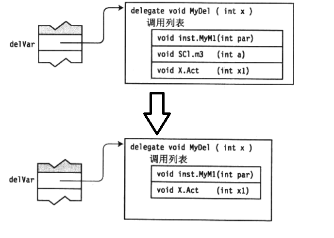

# 委托
## 1、何为委托
```
函数签名：
一个函数由这么几部分组成，函数名、参数个数、参数类型、返回值，函数签名由参数个数与其类型组成。
```
委托是包含相同前面和返回值类型的方法列表（包含单个方法的委托和C++的函数指针相似）。委托在我的个人理解里面就像是某种函数模板，可以用委托变量来代表同样签名的函数，从而可以将该类型的函数作为函数的参数或者作为函数的返回值使用。  


## 2、委托声明和创建
```C# 
delegate void MyDel(int x); // 无返回值，带int参数
```


```C#
MyDel delVar; // 声明
delVar = new MyDel(myInstObj.MyM1); // 利用实例方法进行初始化
MyDel delVar; // 声明
delVar = new MyDel(SClass.MyM1); // 利用静态方法进行初始化
/* 上述等价于 */
delVar = myInstObj.MyM1;
delVar = SClass.MyM1;
```
上述的初始化所得的delVar和dVar的实质是一个引用，分别指向内存中的委托对象。此时除了为委托分配内存，同时也会将第一个方法放入委托的调用列表中。

委托变量可随意更换引用
```C#
MyDel delVar;
delVar = SClass.MyM1;
...
delVar = myInstObj.MyM1; // 更换了引用的委托
```

几种委托定义方式的总结：
```C#
// C# 1.0 and above version
// Declare a delegate.
delegate void Del(string str);

// Declare a method with the same signature as the delegate.
static void Notify(string name)
{
    Console.WriteLine("Notification received for: {0}", name);
}
// Create an instance of the delegate.
Del del1 = new Del(Notify);
Del del2 = Notify; // for C# 2.0 and above

// C# 2.0 and above version
// Instantiate Del by using an anonymous method.
Del del3 = delegate(string name)
    { Console.WriteLine("Notification received for: {0}", name); };

// C# 3.0 and above version
// Instantiate Del by using a lambda expression.
Del del4 = name =>  { Console.WriteLine("Notification received for: {0}", name); };
```


## 3、多播委托（组合委托）
使用 + 和 - 进行委托的组合，如：
```C#
MyDel delVar1 = SClass.MyM1;
MyDel delVar2 = myInstObj.MyM1;
MyDel delVar3 = delVar1 + delVar2;  // 
```


增加委托方法
```C#
MyDel delVar1 = SClass.MyM1;
delVar += SC1.m3;
delVar += X.Act;
```
减少委托方法
```C#
MyDel delVar1 = SClass.MyM1;
delVar += SC1.m3;
delVar += X.Act;

delVar -= X.Act;
```


## 4、委托调用
下述例子中委托的调用列表中的3个方法会被按顺序调用，因为中间值一般是得不到的，如果加入调用列表中的函数有返回值，在调用委托后只能得到调用列表中最后一个函数的返回值。如果想要获得每个函数的返回值，则需要使用逐项遍历调用列表中方法的方式获取。
```C#
MyDel delVar1 = SClass.MyM1;
delVar += SC1.m3;
delVar += X.Act;

...

delVar(55);
```


## 5、匿名方法
```C#
/* 语法 */
delegate (paramaters) { 语法块 }
/* 示例 */
delegate int OtherDel(int InParam);
...
OtherDel del = delegate(int x) {
    return 20;
};  // 匿名方法
```
1、使用匿名方法的场合：
- 作为委托变量的初始化表达式
- 组合委托时放在赋值语句的右边
- 为委托增加事件放在赋值语句右边

匿名方法必须在 参数数量， 参数类型 和 修饰符 三个方面匹配委托（函数签名必须一致）。

2、当委托的参数列表**不包含out参数**，或匿名方法不适应任何参数时，可以使用空圆括号或者省略圆括号来简化匿名函数参数列表


# 事件
## 事件属性
- 发行者确定何时引发事件；订户确定对事件作出何种响应。
- 一个事件可以有多个订户。 订户可以处理来自多个发行者的多个事件。
- 没有订户的事件永远也不会引发。
- 事件通常用于表示用户操作，例如单击按钮或图形用户界面中的菜单选项。
- 当事件具有多个订户时，引发该事件时会同步调用事件处理程序。 若要异步调用事件，请参阅 Calling Synchronous Methods Asynchronously。
- 在 .NET Framework 类库中，事件基于 EventHandler 委托和 EventArgs 基类。

## 事件订阅 和 取消
winform事件的格式
```C#
// 在Form类中定义了事件处理函数
private void Form1_Load(object sender, System.EventArgs e)
{
    // Add your form load event handling code here.
}
// Form1.Designer.cs 文件的 InitializeComponent 方法中自动生成订阅该事件所需的代码行
this.Load += new System.EventHandler(this.Form1_Load);
```
自定义事件处理函数 和 事件订阅
```C#
void HandleCustomEvent(object sender, CustomEventArgs a)  
{  
   // Do something useful here.  
}
// 假设名为 publisher 的对象拥有一个名为 RaiseCustomEvent 的事件，则订阅事件表示为
publisher.RaiseCustomEvent += HandleCustomEvent; // C# 2.0 or above
// 采用lambda表达式订阅事件
public Form1()  
{  
    InitializeComponent();  
    this.Click += (s,e) =>
        {
            MessageBox.Show(((MouseEventArgs)e).Location.ToString());
        };
}
// 采用匿名方法订阅事件
publisher.RaiseCustomEvent += delegate(object o, CustomEventArgs e)  
{  
  string s = o.ToString() + " " + e.ToString();  
  Console.WriteLine(s);  
};
```
取消事件订阅
```C#
publisher.RaiseCustomEvent -= HandleCustomEvent;
```

### .NET Framework模式下的事件委托形式 EventHandler
```C#
public delegate void EventHandler(object sender, EventArgs e);
```
参数含义  
EventArgs类用于给事件传递参数，可用自定义相关的事件参数类；object sender表示触发该事件的对象
```C#
// 事件参数类都必须继承于 EventArgs
public class CustomEventArgs : EventArgs  
{  
    public CustomEventArgs(string s)  
    {  
        msg = s;  
    }  
    private string msg;  
    public string Message  
    {  
        get { return msg; }  
    }   
}
```
定义事件处理函数，委托形式为
```C#
public delegate void CustomEventHandler(object sender, CustomEventArgs a);
```
定义事件，EventHandler这个词可用理解为事件句柄，即事件的标识。 
``` c#
// 使用非自定义的事件参数类
public event EventHandler RaiseCustomEvent;
// 非泛型版本的使用自定义事件参数类
public event CustomEventHandler RaiseCustomEvent;
// 泛型版本的使用自定义事件参数类
public event EventHandler<CustomEventArgs> RaiseCustomEvent;
```

完整示例
```C#
namespace DotNetEvents
{
    using System;
    using System.Collections.Generic;

    // Define a class to hold custom event info
    public class CustomEventArgs : EventArgs
    {
        public CustomEventArgs(string s)
        {
            message = s;
        }
        private string message;

        public string Message
        {
            get { return message; }
            set { message = value; }
        }
    }

    // Class that publishes an event
    // 发布者类，用于发布事件
    class Publisher
    {

        // Declare the event using EventHandler<T>
        public event EventHandler<CustomEventArgs> RaiseCustomEvent;  // 泛型事件

        public void DoSomething()
        {
            // Write some code that does something useful here
            // then raise the event. You can also raise an event
            // before you execute a block of code.
            OnRaiseCustomEvent(new CustomEventArgs("Did something"));

        }

        // Wrap event invocations inside a protected virtual method
        // to allow derived classes to override the event invocation behavior 允许子类覆写这个事件触发函数
        protected virtual void OnRaiseCustomEvent(CustomEventArgs e)
        {
            // Make a temporary copy of the event to avoid possibility of
            // a race condition if the last subscriber unsubscribes
            // immediately after the null check and before the event is raised.
            EventHandler<CustomEventArgs> handler = RaiseCustomEvent;  // 事件

            // Event will be null if there are no subscribers
            if (handler != null)
            {
                // Format the string to send inside the CustomEventArgs parameter
                e.Message += $" at {DateTime.Now}";

                // Use the () operator to raise the event.
                handler(this, e);  // 触发事件
            }
        }
    }

    //Class that subscribes to an event
    class Subscriber
    {
        private string id;
        public Subscriber(string ID, Publisher pub)
        {
            id = ID;
            // Subscribe to the event using C# 2.0 syntax  订阅事件
            pub.RaiseCustomEvent += HandleCustomEvent;
        }

        // Define what actions to take when the event is raised.  定义事件处理函数
        void HandleCustomEvent(object sender, CustomEventArgs e)
        {
            Console.WriteLine(id + " received this message: {0}", e.Message);
        }
    }

    class Program
    {
        static void Main(string[] args)
        {
            Publisher pub = new Publisher();
            Subscriber sub1 = new Subscriber("sub1", pub);  // 可用视为从发布者处订阅事件sub1
            Subscriber sub2 = new Subscriber("sub2", pub); // 可用视为从发布者处订阅事件sub2

            // Call the method that raises the event. 触发事件
            pub.DoSomething();

            // Keep the console window open
            Console.WriteLine("Press Enter to close this window.");
            Console.ReadLine();

        }
    }
}
```


### 派生类引发基类事件

事件是特殊类型的委托，只能从声明它们的类中进行调用。 派生类不能直接调用在基类中声明的事件。 虽然有时可能需要只能由基类引发的事件，不过在大多数情况下，应使派生类可以调用基类事件。 为此，可以在包装事件的基类中创建受保护的调用方法。 通过调用或重写此调用方法，派生类可以间接调用事件（间接使用父类中定义的事件）。

不可用在基类中声明虚拟事件并在派生类中重写它们。 C# 编译器不会处理这些事件，并且无法预知派生事件的订阅者是否实际上会订阅基类事件。

```c#
namespace BaseClassEvents
{
    using System;
    using System.Collections.Generic;

    // Special EventArgs class to hold info about Shapes. 定义事件参数类
    public class ShapeEventArgs : EventArgs
    {
        private double newArea;

        public ShapeEventArgs(double d)
        {
            newArea = d;
        }
        public double NewArea
        {
            get { return newArea; }
        }
    }

    // Base class event publisher
    public abstract class Shape
    {
        protected double area;

        public double Area
        {
            get { return area; }
            set { area = value; }
        }
        // The event. Note that by using the generic EventHandler<T> event type
        // we do not need to declare a separate delegate type.  定义了形状变化事件
        public event EventHandler<ShapeEventArgs> ShapeChanged;

        public abstract void Draw();

        //The event-invoking method that derived classes can override.  定义事件调用函数，虚函数可被子类覆盖
        protected virtual void OnShapeChanged(ShapeEventArgs e)
        {
            // Make a temporary copy of the event to avoid possibility of
            // a race condition if the last subscriber unsubscribes
            // immediately after the null check and before the event is raised.
            EventHandler<ShapeEventArgs> handler = ShapeChanged;
            if (handler != null)
            {
                handler(this, e);
            }
        }
    }

    public class Circle : Shape
    {
        private double radius;
        public Circle(double d)
        {
            radius = d;
            area = 3.14 * radius * radius;
        }
        public void Update(double d)
        {
            radius = d;
            area = 3.14 * radius * radius;
            OnShapeChanged(new ShapeEventArgs(area));
        }
        protected override void OnShapeChanged(ShapeEventArgs e)
        {
            // Do any circle-specific processing here.

            // Call the base class event invocation method.
            base.OnShapeChanged(e);
        }
        public override void Draw()
        {
            Console.WriteLine("Drawing a circle");
        }
    }

    public class Rectangle : Shape
    {
        private double length;
        private double width;
        public Rectangle(double length, double width)
        {
            this.length = length;
            this.width = width;
            area = length * width;
        }
        public void Update(double length, double width)
        {
            this.length = length;
            this.width = width;
            area = length * width;
            OnShapeChanged(new ShapeEventArgs(area));
        }
        protected override void OnShapeChanged(ShapeEventArgs e)
        {
            // Do any rectangle-specific processing here.

            // Call the base class event invocation method.
            base.OnShapeChanged(e);
        }
        public override void Draw()
        {
            Console.WriteLine("Drawing a rectangle");
        }

    }

    // Represents the surface on which the shapes are drawn
    // Subscribes to shape events so that it knows
    // when to redraw a shape.
    public class ShapeContainer
    {
        List<Shape> _list;  // 存放形状的列表

        public ShapeContainer()
        {
            _list = new List<Shape>();
        }

        public void AddShape(Shape s)
        {
            _list.Add(s);
            // Subscribe to the base class event.
            // 订阅事件，同时设置事件处理函数
            s.ShapeChanged += HandleShapeChanged;
        }

        // ...Other methods to draw, resize, etc.

        private void HandleShapeChanged(object sender, ShapeEventArgs e)
        {
            Shape s = (Shape)sender;

            // Diagnostic message for demonstration purposes.
            Console.WriteLine("Received event. Shape area is now {0}", e.NewArea);

            // Redraw the shape here.
            s.Draw();
        }
    }

    class Test
    {

        static void Main(string[] args)
        {
            //Create the event publishers and subscriber
            Circle c1 = new Circle(54);
            Rectangle r1 = new Rectangle(12, 9);
            ShapeContainer sc = new ShapeContainer();

            // Add the shapes to the container.
            sc.AddShape(c1);
            sc.AddShape(r1);

            // Cause some events to be raised.
            c1.Update(57);
            r1.Update(7, 7);

            // Keep the console window open in debug mode.
            System.Console.WriteLine("Press any key to exit.");
            System.Console.ReadKey();
        }
    }
}
/* Output:
        Received event. Shape area is now 10201.86
        Drawing a circle
        Received event. Shape area is now 49
        Drawing a rectangle
 */
```

## 接口事件
类继承自两个或多个接口，且每个接口都具有相同名称的事件。 在这种情况下，**你必须为至少其中一个事件提供显式接口实现**。 为事件编写显式接口实现时，**还必须编写 add 和 remove 事件访问器**。 通常这些访问器由编译器提供，但在这种情况下编译器不提供它们。
```C#
namespace WrapTwoInterfaceEvents
{
    using System;

    public interface IDrawingObject
    {
        // Raise this event before drawing
        // the object.
        event EventHandler OnDraw;
    }
    public interface IShape
    {
        // Raise this event after drawing
        // the shape.
        event EventHandler OnDraw;
    }


    // Base class event publisher inherits two
    // interfaces, each with an OnDraw event
    public class Shape : IDrawingObject, IShape
    {
        // Create an event for each interface event
        event EventHandler PreDrawEvent;
        event EventHandler PostDrawEvent;

        object objectLock = new Object();

        // Explicit interface implementation required.
        // Associate IDrawingObject's event with
        // PreDrawEvent  
        // 必须亲自实现相关的add函数和remove函数
        #region IDrawingObjectOnDraw
        event EventHandler IDrawingObject.OnDraw
        {
            add
            {
                lock (objectLock)
                {
                    PreDrawEvent += value;
                }
            }
            remove
            {
                lock (objectLock)
                {
                    PreDrawEvent -= value;
                }
            }
        }
        #endregion
        // Explicit interface implementation required.
        // Associate IShape's event with
        // PostDrawEvent
        event EventHandler IShape.OnDraw
        {
            add
            {
                lock (objectLock)
                {
                    PostDrawEvent += value;
                }
            }
            remove
            {
                lock (objectLock)
                {
                    PostDrawEvent -= value;
                }
            }


        }

        // For the sake of simplicity this one method
        // implements both interfaces. 
        public void Draw()
        {
            // Raise IDrawingObject's event before the object is drawn.
            PreDrawEvent?.Invoke(this, EventArgs.Empty);

            Console.WriteLine("Drawing a shape.");

            // Raise IShape's event after the object is drawn.
            PostDrawEvent?.Invoke(this, EventArgs.Empty);
        }
    }
    public class Subscriber1
    {
        // References the shape object as an IDrawingObject
        public Subscriber1(Shape shape)
        {
            IDrawingObject d = (IDrawingObject)shape;
            d.OnDraw += d_OnDraw;
        }

        void d_OnDraw(object sender, EventArgs e)
        {
            Console.WriteLine("Sub1 receives the IDrawingObject event.");
        }
    }
    // References the shape object as an IShape
    public class Subscriber2
    {
        public Subscriber2(Shape shape)
        {
            IShape d = (IShape)shape;
            d.OnDraw += d_OnDraw;
        }

        void d_OnDraw(object sender, EventArgs e)
        {
            Console.WriteLine("Sub2 receives the IShape event.");
        }
    }


    public class Program
    {
        static void Main(string[] args)
        {
            Shape shape = new Shape();
            Subscriber1 sub = new Subscriber1(shape);
            Subscriber2 sub2 = new Subscriber2(shape);
            shape.Draw();

            // Keep the console window open in debug mode.
            System.Console.WriteLine("Press any key to exit.");
            System.Console.ReadKey();
        }
    }

}
/* Output:
    Sub1 receives the IDrawingObject event.
    Drawing a shape.
    Sub2 receives the IShape event.
*/
```