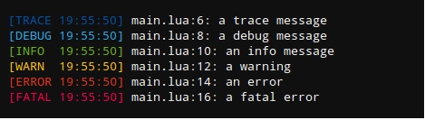

# 简易log模块分析

```lua
--
-- log.lua
--
-- Copyright (c) 2016 rxi
--
-- This library is free software; you can redistribute it and/or modify it
-- under the terms of the MIT license. See LICENSE for details.
--
-- https://github.com/rxi/log.lua

local log = { _version = "0.1.0" }

log.usecolor = true
log.outfile = nil
log.level = "trace"


local modes = {
  { name = "trace", color = "\27[34m", },
  { name = "debug", color = "\27[36m", },
  { name = "info",  color = "\27[32m", },
  { name = "warn",  color = "\27[33m", },
  { name = "error", color = "\27[31m", },
  { name = "fatal", color = "\27[35m", },
}


local levels = {}
for i, v in ipairs(modes) do
  levels[v.name] = i
end


local round = function(x, increment)
  increment = increment or 1
  x = x / increment
  return (x > 0 and math.floor(x + .5) or math.ceil(x - .5)) * increment
end


local _tostring = tostring

local tostring = function(...)
  local t = {}
  for i = 1, select('#', ...) do
    local x = select(i, ...)
    if type(x) == "number" then
      x = round(x, .01)
    end
    t[#t + 1] = _tostring(x)
  end
  return table.concat(t, " ")
end


for i, x in ipairs(modes) do
  local nameupper = x.name:upper()
  log[x.name] = function(...)  -- 闭包
    
    -- Return early if we're below the log level
    if i < levels[log.level] then
      return
    end

    local msg = tostring(...)
    local info = debug.getinfo(2, "Sl")
    local lineinfo = info.short_src .. ":" .. info.currentline

    -- Output to console
    print(string.format("%s[%-6s%s]%s %s: %s",
                        log.usecolor and x.color or "",
                        nameupper,
                        os.date("%H:%M:%S"),
                        log.usecolor and "\27[0m" or "",
                        lineinfo,
                        msg))

    -- Output to log file
    if log.outfile then
      local fp = io.open(log.outfile, "a")  -- 打开文本，追加模式
      local str = string.format("[%-6s%s] %s: %s\n",
                                nameupper, os.date(), lineinfo, msg)
      fp:write(str)
      fp:close()
    end

  end
end


return log
```
涉及知识点
- 可变参数
    不定数量的实参，可以通过传入3点(...)的方式进行参数匹配。  

    1. 一个函数要访问它的变长参数时,仍需要用到3点(...)。但不同的是，此时这3个点是作为一个表达式来使用的。如下
    ```lua
        local a, b = ...
    ```
    2. 表达式{...}:表示由所有变长参数构成的数组table，可以使用遍历table 的方式访问这些参数

- select方法
    调用select时，必须传入一个固定的实参selector(选择哪个位置的参数进行访问)和变长参数本身。如果selector为数字n,那么select返回它的**第n个可变实参**。否则，selector只能为字符串"#"，这样select会**返回变长参数的总数**（包括nil值）。
    
    ```lua
        local function test_variable_arg(...) 
            for index = 1, select('#', ...) do
                local value = select(index, ...)
                print(value)
            end
        end
        test_variable_arg(2,3,4,43,"123", nil)
        -- 5.0以上语法
        function foo(a, b, ...) 
            local arg = {...}
            arg.n = select("#", ...)  -- arg转table，可以以n来记录变长参数的总数
            ...
        end
    ```

- lua debug模块
    https://www.runoob.com/lua/lua-debug.html 
    ```lua
        -- getinfo函数
        getinfo ([thread,] f [, what])
    ```
    返回关于一个函数信息的表。数字 f 表示运行在指定线程的调用栈对应层次上的函数： 0 层表示当前函数（getinfo 自身）； 1 层表示调用 getinfo 的函数 （除非是尾调用，这种情况不计入栈）  
    local info = debug.getinfo(2, "Sl")。 此时会显示调用这个函数的module，因为1层为对应的闭包，而调用该闭包的就是对应的require该log的lua脚本。
    