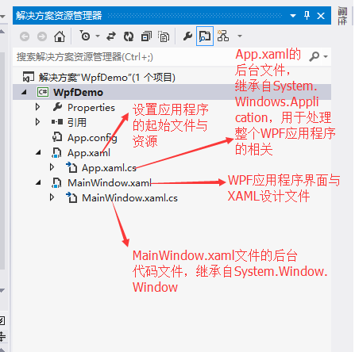
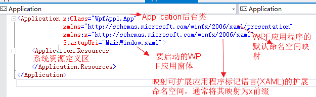
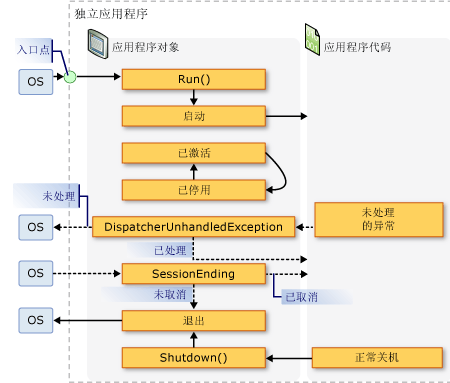
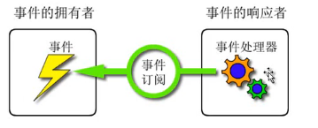
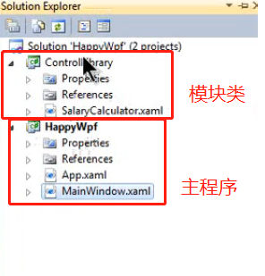

# WPF (Windows Presentation Foundation)
## 特点  
1、统一的编程模型  
WPF提供的编程模型统一普通控件、语音、视频、文档3D等技术，这些媒体类型能够统一协调工作，降低了我们的学习成本。  
2、与分辨率无关  
WPF是基于矢量绘图的，因此它产生的图形界面能够支持各种分辨率的显示设备，而不会像WinForm等在高分辨率的现实设备上产生锯齿。  
3、硬件加速技术  
WPF是基于Direct3D创建。在WPF应用程序中无论是2D还是3D的图形或者文字内容都会被转换为3D三角形、材质和其他Direct3D对象，并由硬件负责渲染，因此它能够更好的利用系统的图像处理单元GPU，从硬件加速中获得好处。  
4、声明式编程  
WPF引入一种新的XAML语言（Extensible Application Markup Language）来开发界面。使用XAML语言将界面开发以及后台逻辑开发很好的分开，降低了前后台开发的耦合度，使用户界面设计师与程序开发者能更好的合作，降低维护和更新的成本。  
5、易于部署  
WPF除了可以使用传统的Windows Installer以及ClickOnce方式来发布我们的桌面应用程序之外，还可以将我们的应用程序稍加改动发布为基于浏览器的应用程序。  

# 工程架构

### 工程目录结构


### 分离架构思想  
WPF与WinForm一样有一个 Application对象来进行一些全局的行为和操作，并且每个 Domain （应用程序域）中仅且只有一个 Application 实例存在。和 WinForm 不同的是WPF Application默认由两部分组成 : App.xaml 和 App.xaml.cs，这有点类似于 Asp.Net WebForm，将定义和行为代码相分离。
### Application功能
-  跟踪应用程序的生存期并与之交互。 
- 检索和处理命令行参数。 
- 检测和响应未经处理的异常。 
- 共享应用程序范围的属性和资源。 
- 管理独立应用程序中的窗口。 
- 跟踪和管理导航。 

#### App.xml文件结构（Application定义所在文件）  


#### Application标签的属性
1、应用程序关闭：可指定Application的ShutdownMode属性设置（应用到标签中，和html中设置属性的方式是一样的）
- OnLastWindowClose（默认值）：  
应用程序关闭时，或最后一个窗口关闭时关闭，或调用Application对象的Shutdown() 方法时，应用程序关闭。

- OnMainWindowClose  
启动窗体关闭或调用Application对象的Shutdown()方法时，应用程序关闭。（和C#的Windows应用程序的关闭模式比较类似）

- OnExplicitShutdown  
只有在调用Application对象的Shutdown()方法时，应用程序才会关闭。

2、Application对象事件类型（触发事件的时间）
- Activated：当应用程序成为前台应用程序时触发
- Deactivated：当应用程序不再是前台应用程序时触发
- DispatcherUnhandledException：如果异常是由应用程序引发，但未处理，触发
- Exit：在应用程序关闭之前，触发，而且不能撤消
- FragmentNavigation：发生在应用程序的一个浏览器启动导航到内容片段导航时，会立即发生，如果所需片段在当前目录，或者，在源 XAML 目录加载后，如果所需片段在其他内容
- LoadCompleted：在导航到在应用程序中的一个浏览器的目录加载分析完成并已呈现时触发
- Navigated：当导航到在应用程序中使用的浏览器已找到的内容时触发，这时它可能还没有完成加载
- Navigating：在一个新的导航由应用程序，一个浏览器请求发生
- NavigationFailed：当应用程序的一个浏览器导航到所请求的内容时出现问题，则会引发该错误事件
- NavigationProgress：定期发生在应用程序中使用浏览器管理提供导航进度信息的下载过程
- NavigationStopped：发生在一个浏览器的 StopLoading 方法在应用程序的调用，或者，如果新的导航由浏览器请求，在当前导航正在进行的
- SessionEnding：当用户在注销或关闭操作系统关闭 Windows 会话时发生
- Startup：当 Application 对象的 Run 方法调用，发生

### WPF应用程序的生命周期
窗口在生命周期内的主体事件的顺序  


### WPF事件 —— 路由事件
路由事件是具有更强传播能力的事件——它可以在元素树上向上冒泡和向下隧道传播，并且沿着传播路径被事件处理程序处理。与依赖属性一样，可以使用传统的事件方式使用路由事件。尽管路由事件的使用方式与传统的事件一样，但是理解其工作原理还是相当重要的。WPF事件的特点是事件可以被传递。

#### 路由事件策略（使用EventManager.RegisterEvent方法注册一个路由事件时，需要传递一个RoutingStrategy枚举值来标识希望应用于事件的事件行为）
- 与普通的.NET事件类似的直接路由事件(Direct event)。它源自一个元素，并且不传递给其他元素。例如，MouseEnter事件(当鼠标移动到一个元素上面时触发)就是一个直接路由事件。
- 在包含层次中向上传递的冒泡路由事件(Bubbling event)。例如，MouseDown事件就是一个冒泡路由事件。它首先被单击的元素触发，接下来就是该元素的父元素触发，依此类推，直到WPF到达元素树的顶部为止。
- 在包含层次中向下传递的隧道路由事件(Tunneling event)。例如PreviewKeyDown就是一个隧道路由事件。在一个窗口上按下某个键，首先是窗口，然后是更具体的容器，直到到达按下键时具有焦点的元素。

# XAML语法
## 什么是XAML
XAML是可扩展应用标记语言的缩写，是微软用于描述GUI的XML变种。在之前的GUI框架如WinForms中，GUI是用相同语言创建，例如C#或VB.NET，并且通常由设计者来维护(例如Visual Studio)。但是，通过XAML，微软使用了另一种方式。非常类似HTML，你现在能轻松编写你的GUI。

## WPF为事件驱动性UI框架
所有的控件, 包括窗体(Window控件)都提供了大量的事件可以订阅. 你可以订阅这些事件，这意味着你的应用程序将在事件发生的时候接受到通知并且你可以对这些事件做成响应。  
事件示例：
```xml
<Window x:Class="WpfTutorialSamples.XAML.EventsSample"
        xmlns="http://schemas.microsoft.com/winfx/2006/xaml/presentation"
        xmlns:x="http://schemas.microsoft.com/winfx/2006/xaml"
        Title="EventsSample" Height="300" Width="300">
    <!-- 此处绑定了MouseUp事件 -->
	<Grid Name="pnlMainGrid" MouseUp="pnlMainGrid_MouseUp" Background="LightBlue">        
		
    </Grid>
</Window>
```
此时C#后台会自动生成相应的事件响应函数。其中MouseUp事件使用的是一个名为MouseButtonEventHandler的委托。
```c#
private void pnlMainGrid_MouseUp(object sender, MouseButtonEventArgs e)
{
	MessageBox.Show("You clicked me at " + e.GetPosition(this).ToString());
}
```
也可以不再标签上绑定事件，直接在后台上指定对应控件的事件
```c#
using System;
using System.Windows;
using System.Windows.Input;


namespace WpfTutorialSamples.XAML
{
	public partial class EventsSample : Window
	{
		public EventsSample()
		{
			InitializeComponent();
			pnlMainGrid.MouseUp += new MouseButtonEventHandler(pnlMainGrid_MouseUp); // 控件的pnlMainGrid对应了一个鼠标抬起事件
		}

		private void pnlMainGrid_MouseUp(object sender, MouseButtonEventArgs e)
		{
			MessageBox.Show("You clicked me at " + e.GetPosition(this).ToString());
		}

	}
}
```


## 资源
将数据保存为资源，该资源可在其它多个地方被使用（局部的控件、全局的视窗等）  
资源可以分为以下几种：
- 静态资源（StaticResource）
    在XAML载入时该资源已被设定并且在后续的代码中不能被改变
    ```XML
    <Window x:Class="WpfTutorialSamples.WPF_Application.ResourceSample"
            xmlns="http://schemas.microsoft.com/winfx/2006/xaml/presentation"
            xmlns:x="http://schemas.microsoft.com/winfx/2006/xaml"
            xmlns:sys="clr-namespace:System;assembly=mscorlib"
            Title="ResourceSample" Height="150" Width="350">
        <Window.Resources>
            <sys:String x:Key="strHelloWorld">Hello, world!</sys:String>
        </Window.Resources>
        <StackPanel Margin="10">
            <TextBlock Text="{StaticResource strHelloWorld}" FontSize="56" />
            <TextBlock>Just another "<TextBlock Text="{StaticResource strHelloWorld}" />" example, but with resources!</TextBlock>
        </StackPanel>
    </Window>
    ```

- 动态资源（DynamicResource）
    在实际使用时资源会被设定一次，且当资源需要被改变时可以被重新设定
- 限定资源位置: 默认情况下资源在整个视窗中可被引用，而我们可以定义资源仅能在某些控件上被使用。
    ```XML
    <StackPanel Margin="10">
    <StackPanel.Resources>
        <sys:String x:Key="ComboBoxTitle">Items:</sys:String>
    </StackPanel.Resources>
    <Label Content="{StaticResource ComboBoxTitle}" />
    </StackPanel>
    ```

- 可以定义资源为application级别，这样可以在其它视窗中被引用
    ```XML
    <Application x:Class="WpfTutorialSamples.App"
                xmlns="http://schemas.microsoft.com/winfx/2006/xaml/presentation"
                xmlns:x="http://schemas.microsoft.com/winfx/2006/xaml"
                xmlns:sys="clr-namespace:System;assembly=mscorlib"
                StartupUri="WPF application/ExtendedResourceSample.xaml">
        <Application.Resources> <!-- 资源为application级别 -->
            <sys:String x:Key="ComboBoxTitle">Items:</sys:String>
        </Application.Resources>
    </Application>
    ```

- 可以在后台程序（非xaml模板）中进行资源的读写
    ```XML
    <!-- app.xaml -->
    <Application x:Class="WpfTutorialSamples.App"
             xmlns="http://schemas.microsoft.com/winfx/2006/xaml/presentation"
             xmlns:x="http://schemas.microsoft.com/winfx/2006/xaml"
             xmlns:sys="clr-namespace:System;assembly=mscorlib"
             StartupUri="WPF application/ResourcesFromCodeBehindSample.xaml">
    <Application.Resources>
        <sys:String x:Key="strApp">Hello, Application world!</sys:String>
    </Application.Resources>
    </Application>

    <!-- 视窗 -->
    <Window x:Class="WpfTutorialSamples.WPF_Application.ResourcesFromCodeBehindSample"
        xmlns="http://schemas.microsoft.com/winfx/2006/xaml/presentation"
        xmlns:x="http://schemas.microsoft.com/winfx/2006/xaml"
        xmlns:sys="clr-namespace:System;assembly=mscorlib"
        Title="ResourcesFromCodeBehindSample" Height="175" Width="250">
    <Window.Resources>
        <sys:String x:Key="strWindow">Hello, Window world!</sys:String>
    </Window.Resources>
    <DockPanel Margin="10" Name="pnlMain">
        <DockPanel.Resources>
            <sys:String x:Key="strPanel">Hello, Panel world!</sys:String>
        </DockPanel.Resources>

        <WrapPanel DockPanel.Dock="Top" HorizontalAlignment="Center" Margin="10">
            <Button Name="btnClickMe" Click="btnClickMe_Click">Click me!</Button>
        </WrapPanel>

        <ListBox Name="lbResult" />
    </DockPanel>
    </Window>
    ```
    后台代码
    ```c#
    using System;
    using System.Windows;

    namespace WpfTutorialSamples.WPF_Application
    {
        public partial class ResourcesFromCodeBehindSample : Window
        {
            public ResourcesFromCodeBehindSample()
            {
                InitializeComponent();
            }

            private void btnClickMe_Click(object sender, RoutedEventArgs e)
            {
                // 注意这里检索资源的对象不同
                lbResult.Items.Add(pnlMain.FindResource("strPanel").ToString());
                lbResult.Items.Add(this.FindResource("strWindow").ToString());
                lbResult.Items.Add(Application.Current.FindResource("strApp").ToString());
            }
        }
    }
    ```
    后台程序寻找资源会从最低层级开始找（即从控件层级开始），如果找不到就会往上到视窗层级，再到整个应用层级，因此上述例子中都引用控件对象来寻找资源是可以的。

## 异常处理
在application级别设置DispatcherUnhandledException事件来捕获在后台没有捕获的异常。举例如下
```xml
<!-- 视窗 -->
<Window x:Class="WpfTutorialSamples.WPF_Application.ExceptionHandlingSample"
        xmlns="http://schemas.microsoft.com/winfx/2006/xaml/presentation"
        xmlns:x="http://schemas.microsoft.com/winfx/2006/xaml"
        Title="ExceptionHandlingSample" Height="200" Width="200">
    <Grid>
        <Button HorizontalAlignment="Center" VerticalAlignment="Center" Click="Button_Click">
            Do something bad!
        </Button>
    </Grid>
</Window>

<!-- app.xaml -->
<Application x:Class="WpfTutorialSamples.App"
             xmlns="http://schemas.microsoft.com/winfx/2006/xaml/presentation"
             xmlns:x="http://schemas.microsoft.com/winfx/2006/xaml"
             DispatcherUnhandledException="Application_DispatcherUnhandledException"
             StartupUri="WPF Application/ExceptionHandlingSample.xaml">
    <Application.Resources>
    </Application.Resources>
</Application>
```
后台
```c#
using System;
using System.Windows;

namespace WpfTutorialSamples.WPF_Application
{
	public partial class ExceptionHandlingSample : Window
	{
		public ExceptionHandlingSample()
		{
			InitializeComponent();
		}

		private void Button_Click(object sender, RoutedEventArgs e)
		{
			string s = null;
			try
			{
				s.Trim();
			}
			catch(Exception ex)
			{
				MessageBox.Show("A handled exception just occurred: " + ex.Message, "Exception Sample", MessageBoxButton.OK, MessageBoxImage.Warning);
			}
			s.Trim();
		}
	}
}

// 后台设置处理异常事件的处理函数
using System;
using System.Windows;

namespace WpfTutorialSamples
{
	public partial class App : Application
	{
		private void Application_DispatcherUnhandledException(object sender, System.Windows.Threading.DispatcherUnhandledExceptionEventArgs e)
		{
			MessageBox.Show("An unhandled exception just occurred: " + e.Exception.Message, "Exception Sample", MessageBoxButton.OK, MessageBoxImage.Warning);
			e.Handled = true;
		}
	}
}

```

## 关于多文化
参考
- https://www.wpf-tutorial.com/zh/504/wpf%E6%87%89%E7%94%A8%E7%A8%8B%E5%BC%8F/%E5%BA%94%E7%94%A8%E7%A8%8B%E5%BA%8F-%E5%8C%BA%E5%9F%9F%E6%80%A7-%E7%95%8C%E9%9D%A2%E5%8C%BA%E5%9F%9F%E6%80%A7/

最简单的方式是在应用开始加载的时候（application_startup 的时候设定当前的语言类型），主要使用了CurrentCulture 和 CurrentUICulture这两个属性
- CurrentCulture属性控制数字和日期等的格式。 默认值来自执行应用程序的计算机的操作系统，可以独立于其操作系统使用的语言进行更改。
- CurrentUICulture属性指定界面应使用的语言。 这仅在您的应用程序支持多种语言时才有意义，例如： 通过使用语言资源文件。 再次，这允许您使用一种区域性语言（例如英语），在处理数字，日期等的输入/输出时使用另一个（例如德语）。

```C#
// App.xaml.cs
using System.Threading;
using System.Globalization; // 必须包含上面两个类库
private void Application_Startup(object sender, StartupEventArgs e)
{
    Thread.CurrentThread.CurrentCulture = new CultureInfo("de-DE");
    Thread.CurrentThread.CurrentUICulture = new CultureInfo("en-US");
}
```
多线程情况下设置默认的多文化选项
```c#
CultureInfo.DefaultThreadCurrentCulture = new CultureInfo("de-DE");
```

## 属性标签
xaml文件被解析的时候，标签都会被定义为类实例，类实例会有自己的属性，我们可以在xaml文件中用类名（例如Button，Stackpanel等）加.加属性名进行赋值。
```xml
<Grid>
    <Button Width="120" Height="30">
        <Button.Content> <!-- 属性标签，Content作为Button这个类型的一个属性被赋值，适用于赋值较为复杂的结构 -->
            <Rectangle Width="20" Height="20" />>
        </Button.Content>
    </Button>
</Grid>
```
颜色渐变矩形
```xml
<Rectangle Width="20" Height="120" Stroke="Blue"> <!-- 用Blue类型的brush赋给Stroke -->
    <Rectangle.Fill>
        <LinearGradientBrush StartPoint="0,0" EndPoint="1,1">
            <LinearGradientBrush.GradientStops>
                <GradientStop Offset="0.2" Color="LightBlue" />
                <GradientStop Offset="0.7" Color="DarkBlue" />
                <GradientStop Offset="1" Color="Blue" />
            </LinearGradientBrush.GradientStops>

        </LinearGradientBrush>
    </Rectangle.Fill>
</Rectangle>
```

## 标签拓展
利用{}来获取资源，其中{}构成的语法就是标签拓展，表示从外部获取资源。
```xml
<Window.Resources>
    <sys:String x:Key="stringHello">Hello WPF!</sys:String>
</Window.Resources>
<Grid>
    <TextBlock Height="24" Width="120" Background="LightBlue" Text="{StaticReasource ReasourceKey=stringHello}" />
    
</Grid>
```

也可以基于数据绑定来完成类似的工作：
```xml
<Grid>
    <TextBlock Height="24" Width="120" Background="LightBlue" Text="{Binding ElementName=sld, Path=Value}" /> 
</Grid>
```

## 依赖属性
依赖属性出现的目的是用来实现WPF中的样式、自动绑定及实现动画等特性。应用场景为：
- 依赖属性加入了属性变化通知、限制、验证等功能。这样可以使我们更方便地实现应用，同时大大减少了代码量。许多之前需要写很多代码才能实现的功能，在WPF中可以轻松实现。
- 节约内存：在WinForm中，每个UI控件的属性都赋予了初始值，这样每个相同的控件在内存中都会保存一份初始值。而WPF依赖属性很好地解决了这个问题，它内部实现使用哈希表存储机制，对多个相同控件的相同属性的值都只保存一份。
- 支持多种提供对象：可以通过多种方式来设置依赖属性的值。可以配合表达式、样式和绑定来对依赖属性设置值。

## 事件处理器 和 代码后置

以点击按钮触发弹窗为例，事件的拥有者是Button控件，订阅者是窗体（window），处理方法是自定义的handler函数。  
代码后置的含义是将事件订阅放到后台实现，在前台可以用 事件名="xxx" 这样的属性赋值方法实现，而在后台可以用 控件对象.事件名 += EventHandler这样的方式实现，其中EventHandler就是自定义的事件处理函数。

## 名称空间 和 x名称空间
将一些常用的模块做成单独的Library，然后在主控件中引入这些Library，从而实现代码复用和模块开发。注意在主工程中引用对应的类库才能使用（reference），用WPF USER ControlLibrary进行设计。 
```xml
<Window xmlns:control="clr-namespace:ControlLibrary;assembly=ControlLibrary" />
<!-- 此处的ControlLibrary就是自定义的模块类,SalaryCalculator为定义在ControlLibrary这个文件中的一个xaml模块，下面 -->

<control:SalaryCalculator ... ></control>
```


### x名称空间
xmlns:x="http://scheme.microsoft.com/winfx/2006/xaml"  
xaml命名空间用于解析xaml文件。