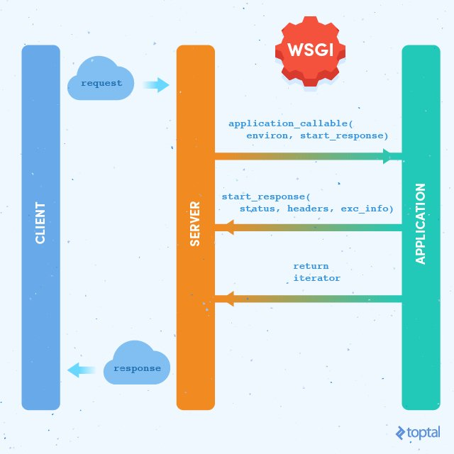
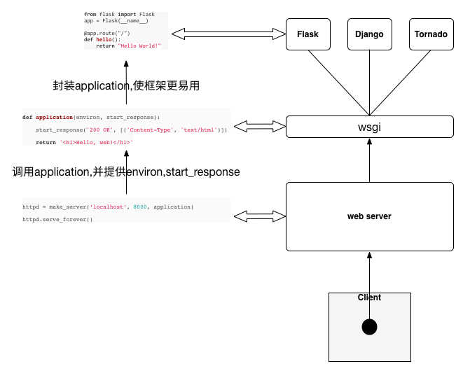

<font face="宋体" />

# 依赖库
werkzeug（ HTTP 和 WSGI 相关的工具集，路由、请求和应答的封装、WSGI 相关的函数） 和 jinja（模板渲染，主要用来渲染返回给用户的 html 文件内容。）

werkzeug提供了python web wsgi开发功能：
- 路由处理：怎么根据请求中的 url 找到它的处理函数
- request 和 response 封装：可以更好地读取 request 的数据，也容易生成响应
- 一个自带的 WSGI server，可以用来测试环境运行自己的应用
```python
from werkzeug.wrappers import Request, Response

def application(environ, start_response):
    request = Request(environ)
    text = 'Hello %s!' % request.args.get('name', 'World')
    response = Response(text, mimetype='text/plain')
    return response(environ, start_response)
```

# WSGI 服务


WSGI规定每个python web 应用都是一个可调用（callable）的对象，这个可调用对象就是app = Flask(\_\_name\_\_)实现的对象

每个app必须实现app(environ,start_response)接口，environ为传递参数，start_response 是 application 处理完之后需要调用的函数，参数是状态码、响应头部还有错误信息。

WSGI的特点为可嵌套，一个application可以调用另一个application，构造proxy或中间件（解耦业务逻辑和其他功能，比如限流、认证、序列化等都实现成不同的中间层，不同的中间层和业务逻辑是不相关的，可以独立维护；而且用户也可以动态地组合不同的中间层来满足不同的需求。）。

# 重点内容

## 路由逻辑（使用的是werkzeug的路由逻辑）
路由的两种常见的等价写法如下：
```python
# 装饰器方式，本质其中使用了add_url_rule api
@app.route('/')
def hello():
    return "hello, world!

# 使用 add_url_rule api
def hello():
    return "hello, world!"

app.add_url_rule('/', 'hello', hello)
```

flask使用werkzeug路由功能作为底层路由功能，其中使用了werkzeug的规则类Rule和映射类Map

werkzeug路由功能
```python
>>> m = Map([
...     Rule('/', endpoint='index'),
...     Rule('/downloads/', endpoint='downloads/index'),
...     Rule('/downloads/<int:id>', endpoint='downloads/show')
... ])
>>> urls = m.bind("example.com", "/")
>>> urls.match("/", "GET")
('index', {})
>>> urls.match("/downloads/42")
('downloads/show', {'id': 42})

>>> urls.match("/downloads")
Traceback (most recent call last):
  ...
RequestRedirect: http://example.com/downloads/
>>> urls.match("/missing")
Traceback (most recent call last):
  ...
NotFound: 404 Not Found
```

werkzeug路由过程是url到endpoint的转换过程。
- m.bind - 把路由表绑定到特定环境  
- m.add - 添加路由规则
- urls.match - 匹配url

正常返回endpoint名字（匹配到对应的view function处理函数，flask中viewpoint和对应的view function存放在字典中）和参数字典，否则为重定向或404错误

_request_ctx_stack 栈保存的是所有的请求信息，而_request_ctx_stack.top.request 保存着当前请求的信息，在每次请求过来的时候，flask 会把当前请求的信息保存进去，这样我们就能在整个请求处理过程中使用它。

_request_ctx_stack存储RequestContext(flask/ctx.py) 对象
```python
def dispatch_request(self):
    """Does the request dispatching.  Matches the URL and returns the
    return value of the view or error handler.  This does not have to
    be a response object.  In order to convert the return value to a
    proper response object, call :func:`make_response`.
    """

    req = _request_ctx_stack.top.request
    if req.routing_exception is not None:
        self.raise_routing_exception(req)
    rule = req.url_rule

    # dispatch to the handler for that endpoint
    return self.view_functions[rule.endpoint](**req.view_args)

class RequestContext(object):
    def __init__(self, app, environ, request=None):
        self.app = app
        self.request = request
        self.url_adapter = app.create_url_adapter(self.request)
        # 获得该请求的匹配规则，即request.url_rule
        self.match_request()

    def match_request(self):
        """Can be overridden by a subclass to hook into the matching
        of the request. 可以重写适应自己的规则，默认是werkzeug的路由匹配规则
        """
        try:
            # url_adapter.match(return_rule=True)会调用rule.match方法对path进行解析，获得其中的路径信息和url参数，self.request.view_args 就是对应的结果的集合 —— werkzeug的match函数（routing.py 的1648行）
            url_rule, self.request.view_args = \
                self.url_adapter.match(return_rule=True)
            self.request.url_rule = url_rule
        except HTTPException as e:
            self.request.routing_exception = e


class Flask(_PackageBoundObject):
    def create_url_adapter(self, request):
        """Creates a URL adapter for the given request.  The URL adapter
        is created at a point where the request context is not yet set up
        so the request is passed explicitly.
        """
        if request is not None:
            # 将app和url_map绑定道WSGI environ变量上，返回的是对应的适配器
            return self.url_map.bind_to_environ(request.environ, server_name=self.config['SERVER_NAME'])
```
路由匹配的流程
- 通过 `@app.route或者app.add_url_rule` 注册应用 url 对应的处理函数，同时事先调用路由匹配逻辑，将路由结果进行保存
- 每次产生请求后，都会调用dispatch_request函数进行请求处理

## 2、上下文context和Local，LocalStack和LocalProxy
- 通俗解释  
每一段程序都有很多外部变量。只有像Add这种简单的函数才是没有外部变量的。一旦你的一段程序有了外部变量，这段程序就不完整，不能独立运行。你为了使他们运行，就要给所有的外部变量一个一个写一些值进去。这些值的集合就叫上下文。

flask使用上下文来封装核心对象（即app）和请求对象（即Request），引入上下文的目的是为了在app或request的基础上引入一些其他参数。

### 引入Local，LocalStack，LocalProxy的目的

但是这些对象和全局变量不同的是——它们必须是动态的，因为在多线程或者多协程的情况下，每个线程或者协程获取的都是自己独特的对象，不会互相干扰。类似于threading.local，实现多线程访问某个变量时只看到自己的数据（实质是线程id对应数据的一个字典，查询线程数据就提取对应的字典中键为id的值）。

综上，需要进行线程隔离，确保每个线程处理自己的请求，不互相干扰。

### flask的上下文 - application context 和 request context

```python
def _lookup_req_object(name):
    top = _request_ctx_stack.top
    if top is None:
        raise RuntimeError(_request_ctx_err_msg)
    return getattr(top, name)


def _lookup_app_object(name):
    top = _app_ctx_stack.top
    if top is None:
        raise RuntimeError(_app_ctx_err_msg)
    return getattr(top, name)


def _find_app():
    top = _app_ctx_stack.top
    if top is None:
        raise RuntimeError(_app_ctx_err_msg)
    return top.app


# context locals
# _request_ctx_stack 是多线程或者协程隔离的栈结构，request 每次都会调用 _lookup_req_object 栈头部的数据来获取保存在里面的 requst context
_request_ctx_stack = LocalStack()
_app_ctx_stack = LocalStack()
current_app = LocalProxy(_find_app)

# 下面的_lookup_req_object会返回对应的请求对象
request = LocalProxy(partial(_lookup_req_object, 'request'))
session = LocalProxy(partial(_lookup_req_object, 'session'))
g = LocalProxy(partial(_lookup_app_object, 'g'))
```

- application context 演化出 current_app 和 g  
- request context     演化出 request 和 session

实质使用的是LocalStack和LocalProxy，用于动态获取上下文，在并发程序中保证每个视图只看到属于自己的上下文，这两个数据结构有werkzeug提供。这两个数据结构都是基于Local进行改造而实现的。


```PYTHON   
# since each thread has its own greenlet we can just use those as identifiers
# for the context.  If greenlets are not available we fall back to the
# current thread ident depending on where it is.
try:
    from greenlet import getcurrent as get_ident
except ImportError:
    try:
        from thread import get_ident
    except ImportError:
        from _thread import get_ident

class Local(object):
    __slots__ = ('__storage__', '__ident_func__')

    def __init__(self):
        # 数据保存在 __storage__ 中，后续访问都是对该属性的操作，__storage__为嵌套字典，map[ident]map[key]value，ident为线程或协程ID，value为新的自带你
        object.__setattr__(self, '__storage__', {})
        # __ident_func__ 是协程的 get_current 或者线程的 get_ident，从而获取当前代码所在线程或者协程的 id
        object.__setattr__(self, '__ident_func__', get_ident)

    def __call__(self, proxy):
        """Create a proxy for a name.直接调用Local(***)可以得到一个Local代理"""
        return LocalProxy(self, proxy)

    # 清空当前线程/协程保存的所有数据
    def __release_local__(self):
        self.__storage__.pop(self.__ident_func__(), None)

    # 下面三个方法实现了属性的访问、设置和删除。
    # 注意到，内部都调用 `self.__ident_func__` 获取当前线程或者协程的 id，然后再访问对应的内部字典。
    # 如果访问或者删除的属性不存在，会抛出 AttributeError。
    # 这样，外部用户看到的就是它在访问实例的属性，完全不知道字典或者多线程/协程切换的实现
    def __getattr__(self, name):
        try:
            return self.__storage__[self.__ident_func__()][name]
        except KeyError:
            raise AttributeError(name)

    def __setattr__(self, name, value):
        ident = self.__ident_func__()
        storage = self.__storage__
        try:
            storage[ident][name] = value
        except KeyError:
            storage[ident] = {name: value}

    def __delattr__(self, name):
        try:
            del self.__storage__[self.__ident_func__()][name]
        except KeyError:
            raise AttributeError(name)
```
LocalStack是一个线程/协程隔离栈，其实质就是一个Local，然后在Local中实现一个stack的列表作为栈。此处要注意的是每个Local都对应着一个线程，因此每个线程在进行LocalStack操作的时候都会找到对应Local和对应的stack进行操作。
```python
class LocalStack(object):
    """This class works similar to a :class:`Local` but keeps a stack
    of objects instead. """

    def __init__(self):
        self._local = Local()
    # 清空当前线程或者协程的栈数据
    def __release_local__(self):
        self._local.__release_local__()
    
    # 返回当前线程或者协程栈顶元素的代理对象
    def __call__(self):
        def _lookup():
            rv = self.top
            if rv is None:
                raise RuntimeError('object unbound')
            return rv
        return LocalProxy(_lookup)

    # push、pop 和 top 三个方法实现了栈的操作，
    # 可以看到栈的数据是保存在 self._local.stack 属性中的
    def push(self, obj):
        """Pushes a new item to the stack"""
        rv = getattr(self._local, 'stack', None)
        # 
        if rv is None:
            self._local.stack = rv = []
        rv.append(obj)
        return rv

    def pop(self):
        """Removes the topmost item from the stack, will return the
        old value or `None` if the stack was already empty.
        """
        stack = getattr(self._local, 'stack', None)
        if stack is None:
            return None
        elif len(stack) == 1:
            release_local(self._local)
            return stack[-1]
        else:
            return stack.pop()

    @property
    def top(self):
        """The topmost item on the stack.  If the stack is empty,
        `None` is returned.
        """
        try:
            return self._local.stack[-1]
        except (AttributeError, IndexError):
            return None
```
LocalProxy 是一个 Local 对象的代理，负责把所有对自己的操作转发给内部的 Local 对象。LocalProxy 的构造函数介绍一个 callable 的参数，这个 callable 调用之后需要返回一个 Local 实例，后续所有的属性操作都会转发给 callable 返回的对象。此时会根据对应线程的ID信息来获取对应的请求信息等。

```python
class LocalProxy(object):
    """Acts as a proxy for a werkzeug local.
    Forwards all operations to a proxied object. """
    __slots__ = ('__local', '__dict__', '__name__')

    def __init__(self, local, name=None):
        # 双下划线的属性，会保存到 _ClassName__variable 中。此处使用了Python中的“私有属性”语法
        object.__setattr__(self, '_LocalProxy__local', local)
        object.__setattr__(self, '__name__', name)

    def _get_current_object(self):
        """Return the current object."""
        if not hasattr(self.__local, '__release_local__'):
            return self.__local()
        try:
            # 
            return getattr(self.__local, self.__name__)
        except AttributeError:
            raise RuntimeError('no object bound to %s' % self.__name__)

    @property
    def __dict__(self):
        try:
            return self._get_current_object().__dict__
        except RuntimeError:
            raise AttributeError('__dict__')

    def __getattr__(self, name):
        if name == '__members__':
            return dir(self._get_current_object())
        return getattr(self._get_current_object(), name)

    def __setitem__(self, key, value):
        self._get_current_object()[key] = value

```

总结：  
每次有请求过来的时候，flask 会先创建当前线程或者进程需要处理的两个重要上下文对象，把它们保存到隔离的栈里面，这样视图函数进行处理的时候就能直接从栈上获取这些信息。

# 参考
https://cizixs.com/2017/01/11/flask-insight-start-process/ 