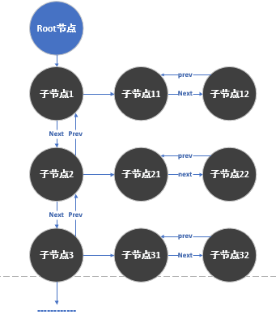

# 涉及的基础知识
## 1、volatile 关键字
一种类型修饰符，用它声明的类型变量表示可以被某些编译器未知的因素更改，比如：操作系统、硬件或者其它线程等。遇到这个关键字声明的变量，编译器对访问该变量的代码就不再进行优化，从而可以提供对特殊地址的稳定访问。声明时语法：int volatile vInt; 当要求使用 volatile 声明的变量的值的时候，系统总是重新从它所在的内存读取数据，即使它前面的指令刚刚从该处读取过数据。而且读取的数据立刻被保存。

[volatile关键字作用](https://www.cnblogs.com/yc_sunniwell/archive/2010/07/14/1777432.html)

## 2、_MSC_VER
代表的是Visual studio的c++编译器的主版本和副版本号。可以通过这个标志来确定当前系统是Windows还是其它类型系统。

## 3、pragma
用于设定编译器的状态或者是指示编译器完成一些特定的动作
#### 1、pragma once：

这是一个比较常用的指令,只要在头文件的最开始加入这条指令就能够保证头文件被编译一次，避免文件被重复包含。
#### 2、pragma comment：
 该指令的格式：#pragma comment( comment-type [,"commentstring"] )

该指令将一个注释记录放入一个对象文件或可执行文件中。
- comment-type(注释类型):可以指定为五种预定义的标识符的其中一种。
- commentstring是一个提供为comment-type提供附加信息的字符串，

comment-type类型：

- **compiler**: 将编译器的版本号和名称放入目标文件中,本条注释记录将被编译器忽略。如果你为该记录类型提供了commentstring参数,编译器将会产生一个警告。例如:#pragma comment( compiler )  
- **exestr**：将commentstring参数放入目标文件中,在链接的时候这个字符串将被放入到可执行文件中。当操作系统加载可执行文件的时候,该参数字符串不会被加载到内存中.但是,该字符串可以被dumpbin之类的程序查找出并打印出来,你可以用这个标识符将版本号码之类 的信息嵌入到可执行文件中!


## 4、memset函数
每种类型的变量都有各自的初始化方法，memset() 函数可以说是初始化内存的“万能函数”，通常为新申请的内存进行初始化工作。
```C
# include <string.h>
void *memset(void *s, int c, unsigned long n);
```
函数的功能是：将指针变量 s 所指向的前 n 字节的内存单元用一个“整数” c 替换，注意 c 是 int 型。s 是 void* 型的指针变量，所以它可以为任何类型的数据进行初始化。  
memset 一般使用“0”初始化内存单元，而且通常是给数组或结构体进行初始化。一般的变量如 char、int、float、double 等类型的变量直接初始化即可，没有必要用 memset。  
memset 函数的第三个参数 n 的值一般用 sizeof()  获取，这样比较专业。注意，如果是对指针变量所指向的内存单元进行清零初始化，那么一定要先对这个指针变量进行初始化，即一定要先让它指向某个有效的地址。而且用memset给指针变量如p所指向的内存单元进行初始化时，n 千万别写成 sizeof(p)，这是新手经常会犯的错误。因为 p 是指针变量，不管 p 指向什么类型的变量，sizeof(p) 的值都是 4。

## 5、strncmp函数
函数原型：
```C
#include <string.h>
extern int strcmp(char *str1,char * str2，int n)
```
- 参数说明：str1为第一个要比较的字符串，str2为第二个要比较的字符串，n为指定的str1与str2的比较的字符数。  
- 函数功能：比较字符串str1和str2的前n个字符。  
- 返回说明：返回整数值：当str1<str2时，返回值<0； 当str1=str2时，返回值=0； 当str1>str2时，返回值>0。


## 6、strtod函数
```C
double strtod(const char *str, char **endptr) 
```
把参数 str 所指向的字符串转换为一个浮点数（类型为 double 型）。如果 endptr 不为空，则指向转换中最后一个字符后的字符的指针会存储在 endptr 引用的位置。

## 6、关于 const_cast 和 static_cast
onst_cast是一种C++运算符，主要是用来去除复合类型中const和volatile属性（没有真正去除）。

变量本身的const属性是不能去除的，要想修改变量的值，一般是去除指针（或引用）的const属性，再进行间接修改。

用法:
```C
const_cast<type>(expression)
```
通过const_cast运算符，也只能将const type*转换为type*，将const type&转换为type&。

# cjson风格
## 构造Json字符串
其整体将json中的每个元素作为一个节点，然后构建成多级链表的结构，如下所示：
```json
{
    "a":123,
    "b":123.12,
    "c":"hello world",
    "d":[1231,131,3123,312],
    "e":{
        "aa":123,
        "bb":1.0
    }
}
```
"a":123会成为一个节点，其prev值为null，next为b，child为null，而valuetype为int，同时value值为123。一开始cJson会构建一个root节点，该root节点就是最外层的{}对应的节点，此后以该root节点不断进行拓展，拓展成树结构。child节点是一个链表，会不断扩充。其架构图如下所示：  


### 1、将一些常用操作（同一模式下的操作，例如内存管理等）封装到结构体中
如下所示，定义一个内部调用的hooks结构体，结构体中保存了3个关于内存分配（分配内存，释放内存，重新分配内存）的方法，allocate，deallocate和reallocate。同时针对不同的操作系统环境，分配内存的方式不一样。这3个钩子函数会对应到实际的内部内存分配函数上。而后续调用这个函数基本使用全局的结构体进行调用。


### (CJSON *) cJSON_CreateObject(void) 函数
构造一个json对象，其实质是一个调用cJSON_New_Item(&global_hooks)调用全局分配内存的结构体进行json-item的内存分配工作。cJSON_CreateObject的实质是构建一个object对象。后续还有cJSON_CreateString，cJSON_CreateNumber，cJSON_CreateTrue等函数，这些函数都是返回一个Cjson-item结构体，并指定对应的type（数值，字符串，object等）   
每个CJSON-item都是如下的结构体：
```C
/* The cJSON structure: */
typedef struct cJSON
{
    /* next/prev allow you to walk array/object chains. Alternatively, use GetArraySize/GetArrayItem/GetObjectItem */
    struct cJSON *next;
    struct cJSON *prev;
    /* An array or object item will have a child pointer pointing to a chain of the items in the array/object. */
    struct cJSON *child;

    /* The type of the item, as above. */
    int type;

    /* The item's string, if type==cJSON_String  and type == cJSON_Raw */
    char *valuestring;
    /* writing to valueint is DEPRECATED, use cJSON_SetNumberValue instead */
    /* 全部统一成float类型，而不是int类型 */
    int valueint;
    /* The item's number, if type==cJSON_Number */
    double valuedouble;

    /* The item's name string, if this item is the child of, or is in the list of subitems of an object. */
    /* 该项为item的名称，即键，该名称会被保存到某个父object的子list中，用于作为object识别子item的标识 */
    char *string;
} cJSON;
```
cJSON结构体中存放了多种可能类型（Json具有层级关系，因此有next，prev和child来指明其相关元素），而type指定了json的类型，类型定义如下：
```C
/* cJSON Types: */
/* 定义相关的type，用二进制数定义 */
#define cJSON_Invalid (0)
#define cJSON_False  (1 << 0)  // 1
#define cJSON_True   (1 << 1)  // 2
#define cJSON_NULL   (1 << 2)  // 4
#define cJSON_Number (1 << 3)  // 8
#define cJSON_String (1 << 4)  // 16
#define cJSON_Array  (1 << 5)  // 32
#define cJSON_Object (1 << 6)  // 64
#define cJSON_Raw    (1 << 7) /* raw json */

#define cJSON_IsReference 256
#define cJSON_StringIsConst 512
```
根据不同的类型，会对cJSON结构体中的value_string, value_int,value_double和char *string 进行赋值处理。

以cJSON_CreateString 和 cJSON_CreateArray为例：
```C
CJSON_PUBLIC(cJSON *) cJSON_CreateString(const char *string)
{
    cJSON *item = cJSON_New_Item(&global_hooks);  // 分配内存
    if(item)
    {
        item->type = cJSON_String;  // 指定类型为type
        item->valuestring = (char*)cJSON_strdup((const unsigned char*)string, &global_hooks); // 深拷贝，将string深拷贝给item->valuestring
        if(!item->valuestring)  // 
        {
            cJSON_Delete(item);
            return NULL;
        }
    }

    return item;
}

static unsigned char* cJSON_strdup(const unsigned char* string, const internal_hooks * const hooks)
{
    size_t length = 0;
    unsigned char *copy = NULL;

    if (string == NULL)
    {
        return NULL;
    }

    length = strlen((const char*)string) + sizeof("");  // 获得要拷贝的字符串的长度
    copy = (unsigned char*)hooks->allocate(length);  // 分配对应的内存，失败返回NULL
    if (copy == NULL)
    {
        return NULL;
    }
    memcpy(copy, string, length);  // 拷贝字符串到copy中

    return copy;
}
```

```C
CJSON_PUBLIC(cJSON *) cJSON_CreateArray(void)
{
    cJSON *item = cJSON_New_Item(&global_hooks);
    if(item)
    {
        item->type=cJSON_Array;
    }

    return item;
}
```
同时为了方便层级关系的构建，提供了cJSON_AddxxxToObject等接口（xxx可以为NUMBER，ITEM，BOOL或其它）  
cJSON_AddxxxToObject实质是调用了如下的add_item_to_object函数，参数含义为object为父object，string为要添加到object的字符串，item为要添加到object的item，hooks为分配内存的钩子结构体，constant_key表示添加item到object上，同时以一个常字符串作为其键。就是这个函数是可以添加多种类型的item。
```C
static cJSON_bool add_item_to_object(cJSON * const object, const char * const string, cJSON * const item, const internal_hooks * const hooks, const cJSON_bool constant_key)
{
    char *new_key = NULL;
    int new_type = cJSON_Invalid;

    if ((object == NULL) || (string == NULL) || (item == NULL)) // 如果3者都不是，返回错误
    {
        return false;
    }

    if (constant_key)  // 
    {
        new_key = (char*)cast_away_const(string);  // 去除const属性
        new_type = item->type | cJSON_StringIsConst;  // 表明该item是以常字符串作为键
    }
    else
    {
        new_key = (char*)cJSON_strdup((const unsigned char*)string, hooks);  // 深拷贝，得到键值
        if (new_key == NULL)
        {
            return false;
        }

        new_type = item->type & ~cJSON_StringIsConst; // 非常量键
    }

    if (!(item->type & cJSON_StringIsConst) && (item->string != NULL))  // item非常键，而且item的string属性为空，则清空item的string列表
    {
        hooks->deallocate(item->string);
    }

    item->string = new_key;  // 确定键名
    item->type = new_type;   // 确定item type

    return add_item_to_array(object, item);  // 将该item加入到object的子列表中，后续可根据item的string属性来找到这个item
}

static cJSON_bool add_item_to_array(cJSON *array, cJSON *item)
{
    cJSON *child = NULL;

    if ((item == NULL) || (array == NULL))
    {
        return false;
    }

    child = array->child;  // 先获取object的子链表

    if (child == NULL)  // 子链表为空，则直接将item作为首项
    {
        /* list is empty, start new one */
        array->child = item;
    }
    else
    {
        /* append to the end */
        while (child->next)
        {
            child = child->next;
        }
        suffix_object(child, item);  // 将item作为现在这个child的兄弟节点，从而插入object的子链表中
    }

    return true;
}

static void suffix_object(cJSON *prev, cJSON *item)
{
    prev->next = item;
    item->prev = prev;
}
```

## 解析Json字符串
分析过程中会将json字符串转化为一个parse_buffer看待，如下
```C
typedef struct
{
    const unsigned char *content;  // 文本内容
    size_t length;  // 内容长度
    size_t offset;  // 读取的内容偏移（根据这个偏移来确定读取到哪里）
    size_t depth; /* How deeply nested (in arrays/objects) is the input at the current offset. */
    internal_hooks hooks;
} parse_buffer;
```
其中定义了很多相关的辅助宏函数，用于进行位置的判断(通过比较当前的起点 + offset 是不是会超过 (buffer)的length)，这个可以学习一下，可以不用做那么多复杂函数：
```C
/* check if the given size is left to read in a given parse buffer (starting with 1) */
#define can_read(buffer, size) ((buffer != NULL) && (((buffer)->offset + size) <= (buffer)->length))
/* check if the buffer can be accessed at the given index (starting with 0) */
#define can_access_at_index(buffer, index) ((buffer != NULL) && (((buffer)->offset + index) < (buffer)->length))
#define cannot_access_at_index(buffer, index) (!can_access_at_index(buffer, index))
/* get a pointer to the buffer at the position */
#define buffer_at_offset(buffer) ((buffer)->content + (buffer)->offset)
```


```C
/* Parse an object - create a new root, and populate. */
CJSON_PUBLIC(cJSON *) cJSON_ParseWithOpts(const char *value, const char **return_parse_end, cJSON_bool require_null_terminated)
{
    parse_buffer buffer = { 0, 0, 0, 0, { 0, 0, 0 } };
    cJSON *item = NULL;

    /* reset error position */
    global_error.json = NULL;
    global_error.position = 0;

    if (value == NULL)
    {
        goto fail;
    }

    buffer.content = (const unsigned char*)value;  // 将json字符串内容全部拷入content中
    buffer.length = strlen((const char*)value) + sizeof("");  // 获取content的length
    buffer.offset = 0;  // 偏移先设置为0
    buffer.hooks = global_hooks;

    item = cJSON_New_Item(&global_hooks);  // 新建item
    if (item == NULL) /* memory fail */
    {
        goto fail;
    }

    // skip_utf8_bom 这个函数是去掉bom的一些首字符
    // buffer_skip_whitespace这个函数是去掉字符串前面存在的空格部分
    // 进入parse_value函数，这个函数中存在一个分支结构，用于确定当前要解析的串是一个object还是数值还是字符串...
    if (!parse_value(item, buffer_skip_whitespace(skip_utf8_bom(&buffer)))) 
    {
        /* parse failure. ep is set. */
        goto fail;
    }

    /* if we require null-terminated JSON without appended garbage, skip and then check for a null terminator */
    if (require_null_terminated)
    {
        buffer_skip_whitespace(&buffer);
        if ((buffer.offset >= buffer.length) || buffer_at_offset(&buffer)[0] != '\0')
        {
            goto fail;
        }
    }
    if (return_parse_end)
    {
        *return_parse_end = (const char*)buffer_at_offset(&buffer);
    }

    return item;

fail:
    if (item != NULL)
    {
        cJSON_Delete(item);
    }

    if (value != NULL)
    {
        error local_error;
        local_error.json = (const unsigned char*)value;
        local_error.position = 0;

        if (buffer.offset < buffer.length)
        {
            local_error.position = buffer.offset;
        }
        else if (buffer.length > 0)
        {
            local_error.position = buffer.length - 1;
        }

        if (return_parse_end != NULL)
        {
            *return_parse_end = (const char*)local_error.json + local_error.position;
        }

        global_error = local_error;
    }

    return NULL;
}

/* Default options for cJSON_Parse */
CJSON_PUBLIC(cJSON *) cJSON_Parse(const char *value)
{
    return cJSON_ParseWithOpts(value, 0, 0);
}
```
parse_value函数，分支结构确定当前解析的部分是字符串还是object还是数值
```C
/* Parser core - when encountering text, process appropriately. */
static cJSON_bool parse_value(cJSON * const item, parse_buffer * const input_buffer)
{
    if ((input_buffer == NULL) || (input_buffer->content == NULL))
    {
        return false; /* no input */
    }

    /* parse the different types of values */
    /* null */
    if (can_read(input_buffer, 4) && (strncmp((const char*)buffer_at_offset(input_buffer), "null", 4) == 0))
    {
        item->type = cJSON_NULL;
        input_buffer->offset += 4;
        return true;
    }
    /* false */
    if (can_read(input_buffer, 5) && (strncmp((const char*)buffer_at_offset(input_buffer), "false", 5) == 0))
    {
        item->type = cJSON_False;
        input_buffer->offset += 5;
        return true;
    }
    /* true */
    if (can_read(input_buffer, 4) && (strncmp((const char*)buffer_at_offset(input_buffer), "true", 4) == 0))
    {
        item->type = cJSON_True;
        item->valueint = 1;
        input_buffer->offset += 4;
        return true;
    }
    /* string */
    if (can_access_at_index(input_buffer, 0) && (buffer_at_offset(input_buffer)[0] == '\"'))
    {
        return parse_string(item, input_buffer);
    }
    /* number */
    if (can_access_at_index(input_buffer, 0) && ((buffer_at_offset(input_buffer)[0] == '-') || ((buffer_at_offset(input_buffer)[0] >= '0') && (buffer_at_offset(input_buffer)[0] <= '9'))))
    {
        return parse_number(item, input_buffer);
    }
    /* array */
    if (can_access_at_index(input_buffer, 0) && (buffer_at_offset(input_buffer)[0] == '['))
    {
        return parse_array(item, input_buffer);
    }
    /* object */
    if (can_access_at_index(input_buffer, 0) && (buffer_at_offset(input_buffer)[0] == '{'))
    {
        return parse_object(item, input_buffer);
    }

    return false;
}
```
以parse_number为例，

```C
/* Parse the input text to generate a number, and populate the result into item. */
static cJSON_bool parse_number(cJSON * const item, parse_buffer * const input_buffer)
{
    double number = 0;
    unsigned char *after_end = NULL;
    unsigned char number_c_string[64];  // 数字的长度只能是64位（包含小数部分）
    unsigned char decimal_point = get_decimal_point(); // 定点数值
    size_t i = 0;

    if ((input_buffer == NULL) || (input_buffer->content == NULL))
    {
        return false;
    }

    /* copy the number into a temporary buffer and replace '.' with the decimal point
     * of the current locale (for strtod)
     * This also takes care of '\0' not necessarily being available for marking the end of the input */
    for (i = 0; (i < (sizeof(number_c_string) - 1)) && can_access_at_index(input_buffer, i); i++)
    {
        switch (buffer_at_offset(input_buffer)[i])
        {
            case '0':
            case '1':
            case '2':
            case '3':
            case '4':
            case '5':
            case '6':
            case '7':
            case '8':
            case '9':
            case '+':
            case '-':
            case 'e':
            case 'E':
                number_c_string[i] = buffer_at_offset(input_buffer)[i];
                break;

            case '.':
                number_c_string[i] = decimal_point;
                break;

            default:
                goto loop_end;
        }
    }
loop_end:
    number_c_string[i] = '\0';

    number = strtod((const char*)number_c_string, (char**)&after_end);
    if (number_c_string == after_end)
    {
        return false; /* parse_error */
    }

    item->valuedouble = number;

    /* use saturation in case of overflow */
    if (number >= INT_MAX)
    {
        item->valueint = INT_MAX;
    }
    else if (number <= (double)INT_MIN)
    {
        item->valueint = INT_MIN;
    }
    else
    {
        item->valueint = (int)number;
    }

    item->type = cJSON_Number;

    input_buffer->offset += (size_t)(after_end - number_c_string);
    return true;
}

```
以parse_object为例，每一个解析的开头都会先进入parse_object函数，因为所有的json字符串都会以 "{" 开头。
```C
/* Build an object from the text. */
static cJSON_bool parse_object(cJSON * const item, parse_buffer * const input_buffer)
{
    cJSON *head = NULL; /* linked list head  链表头节点 */
    cJSON *current_item = NULL;  // 当前节点

    if (input_buffer->depth >= CJSON_NESTING_LIMIT)  // CJSON_NESTING_LIMIT = 1000 单级链表深度只能是1000
    {
        return false; /* to deeply nested */
    }
    input_buffer->depth++;  // 重置当前链表深度

    if (cannot_access_at_index(input_buffer, 0) || (buffer_at_offset(input_buffer)[0] != '{'))  // 错误情况，当前字符不是 { 或者已经无法读值。
    {
        goto fail; /* not an object */
    }

    input_buffer->offset++;  // offset置为下一位，准备读值
    buffer_skip_whitespace(input_buffer);  // 跳过其中的空格
    if (can_access_at_index(input_buffer, 0) && (buffer_at_offset(input_buffer)[0] == '}'))  // 已经读到了 "}"，表明读到了这个{}空object
    {
        goto success; /* empty object */
    }

    /* check if we skipped to the end of the buffer */
    if (cannot_access_at_index(input_buffer, 0))
    {
        input_buffer->offset--;
        goto fail;
    }

    /* step back to character in front of the first element */
    input_buffer->offset--;
    /* loop through the comma separated array elements */
    do
    {
        /* allocate next item */
        cJSON *new_item = cJSON_New_Item(&(input_buffer->hooks));
        if (new_item == NULL)
        {
            goto fail; /* allocation failure */
        }

        /* attach next item to list */
        if (head == NULL)
        {
            /* start the linked list */
            current_item = head = new_item;
        }
        else
        {
            /* add to the end and advance */
            current_item->next = new_item;
            new_item->prev = current_item;
            current_item = new_item;
        }

        /* parse the name of the child 解析键的名称 */
        input_buffer->offset++;
        buffer_skip_whitespace(input_buffer);
        if (!parse_string(current_item, input_buffer)) // 用parse_string的方法进行解析
        {
            goto fail; /* failed to parse name */
        }
        buffer_skip_whitespace(input_buffer);

        /* swap valuestring and string, because we parsed the name 务必将值转为名称，然后将值置空，因为我们借用parse_string方法解析名称 */
        current_item->string = current_item->valuestring;
        current_item->valuestring = NULL;

        if (cannot_access_at_index(input_buffer, 0) || (buffer_at_offset(input_buffer)[0] != ':')) // 确认名字的后一位为 : 
        {
            goto fail; /* invalid object */
        }

        /* parse the value */
        input_buffer->offset++;
        buffer_skip_whitespace(input_buffer);
        if (!parse_value(current_item, input_buffer))  // 递归调用parse_value方法
        {
            goto fail; /* failed to parse value */
        }
        buffer_skip_whitespace(input_buffer);
    }
    while (can_access_at_index(input_buffer, 0) && (buffer_at_offset(input_buffer)[0] == ','));  // 一直到该object结束，object结束的标志是对应子项不以 , 结尾。

    if (cannot_access_at_index(input_buffer, 0) || (buffer_at_offset(input_buffer)[0] != '}'))  // 如果解析完整个object后却没有找到 "}" 项，则抛出
    {
        goto fail; /* expected end of object */
    }

success:
    input_buffer->depth--;

    item->type = cJSON_Object;
    item->child = head;

    input_buffer->offset++;
    return true;

fail:
    if (head != NULL)
    {
        cJSON_Delete(head);
    }

    return false;
}


```
parse_string函数：用于获得键，或者设定字符串类型的值
```C
/* Parse the input text into an unescaped cinput, and populate item. */
static cJSON_bool parse_string(cJSON * const item, parse_buffer * const input_buffer)
{
    const unsigned char *input_pointer = buffer_at_offset(input_buffer) + 1;
    const unsigned char *input_end = buffer_at_offset(input_buffer) + 1;
    unsigned char *output_pointer = NULL;
    unsigned char *output = NULL;

    /* not a string 如果该值并不是string，就是不是以" 开头 */
    if (buffer_at_offset(input_buffer)[0] != '\"')
    {
        goto fail;
    }

    {
        /* calculate approximate size of the output (overestimate) */
        size_t allocation_length = 0;
        size_t skipped_bytes = 0;
        while (((size_t)(input_end - input_buffer->content) < input_buffer->length) && (*input_end != '\"')) // 保证长度范围在length范围内，同时还没有到字符串尾 " ，即到达 " 后中止该循环，表示字符串读完
        {
            /* is escape sequence */
            if (input_end[0] == '\\')  // 遇到转义字符
            {
                if ((size_t)(input_end + 1 - input_buffer->content) >= input_buffer->length)
                {
                    /* prevent buffer overflow when last input character is a backslash */
                    goto fail;
                }
                skipped_bytes++;  // 跳过的字符数
                input_end++;  // 尾指针递增
            }
            input_end++;
        }
        if (((size_t)(input_end - input_buffer->content) >= input_buffer->length) || (*input_end != '\"')) // 字符串意外终结
        {
            goto fail; /* string ended unexpectedly */
        } 

        /* This is at most how much we need for the output 通过上面计算出总的要分配给该字符串的内存长度 */
        allocation_length = (size_t) (input_end - buffer_at_offset(input_buffer)) - skipped_bytes; 
        output = (unsigned char*)input_buffer->hooks.allocate(allocation_length + sizeof("")); // 分配内存空间
        if (output == NULL)
        {
            goto fail; /* allocation failure */
        }
    }

    output_pointer = output;
    /* loop through the string literal */
    while (input_pointer < input_end)  // 开始遍历字面量
    {
        if (*input_pointer != '\\')  // 普通字符，直接赋值带过
        {
            *output_pointer++ = *input_pointer++;
        }
        /* escape sequence */
        else  // 遇到转义字符或特殊字符，需要将形如\t这样两个字符转成 "\t" 的形式
        {
            unsigned char sequence_length = 2;
            if ((input_end - input_pointer) < 1) // 如果此时没有2个字节的长度，则抛出
            {
                goto fail;
            }

            switch (input_pointer[1])
            {
                case 'b':
                    *output_pointer++ = '\b';
                    break;
                case 'f':
                    *output_pointer++ = '\f';
                    break;
                case 'n':
                    *output_pointer++ = '\n';
                    break;
                case 'r':
                    *output_pointer++ = '\r';
                    break;
                case 't':
                    *output_pointer++ = '\t';
                    break;
                case '\"':
                case '\\':
                case '/':
                    *output_pointer++ = input_pointer[1];
                    break;

                /* UTF-16 literal */
                case 'u':  // 针对\u类型的utf-16字面量
                    sequence_length = utf16_literal_to_utf8(input_pointer, input_end, &output_pointer);
                    if (sequence_length == 0)
                    {
                        /* failed to convert UTF16-literal to UTF-8 */
                        goto fail;
                    }
                    break;

                default:
                    goto fail;
            }
            input_pointer += sequence_length;
        }
    }

    /* zero terminate the output */
    *output_pointer = '\0';

    item->type = cJSON_String;
    item->valuestring = (char*)output;

    input_buffer->offset = (size_t) (input_end - input_buffer->content);
    input_buffer->offset++;

    return true;

fail:
    if (output != NULL)
    {
        input_buffer->hooks.deallocate(output);
    }

    if (input_pointer != NULL)
    {
        input_buffer->offset = (size_t)(input_pointer - input_buffer->content);
    }

    return false;
}
```

## 输出json字符串
输出json字符串也是利用buffer的格式逐项输出。
```C
typedef struct
{
    unsigned char *buffer;
    size_t length;
    size_t offset;
    size_t depth; /* current nesting depth (for formatted printing) */
    cJSON_bool noalloc;
    cJSON_bool format; /* is this print a formatted print */
    internal_hooks hooks;
} printbuffer;
```
同样的，print函数会调用print_value()函数，该函数会判断当前需要打印的类型是字符串，数值还是新的object等。  
以print_object为例，所有的json字符串的输出都会先走进这个函数。这里的格式化输出意味这输出的形式为如下所示格式，level不同，开头 \t 的数量不同，同时每个 { 后必须带 \n
```text
{\n
\t"a":"b",
\t"c":{\n
\t\t"d":"d",
\t\t"f":"f",
}
}
```
```C
/* Render an object to text. */
static cJSON_bool print_object(const cJSON * const item, printbuffer * const output_buffer)
{
    unsigned char *output_pointer = NULL;  // 始终指向输出的json字符串的最后一个字符，即output_buffer中buffer对应的最后一个字符位置
    size_t length = 0;
    cJSON *current_item = item->child;

    if (output_buffer == NULL)
    {
        return false;
    }

    /* Compose the output: */
    length = (size_t) (output_buffer->format ? 2 : 1); /* fmt: {\n，此时\n 需要2个字节 */
    output_pointer = ensure(output_buffer, length + 1);  // 确保有足够的字符长度来存放输出值
    if (output_pointer == NULL)
    {
        return false;
    }

    *output_pointer++ = '{';  // 开始
    output_buffer->depth++;
    if (output_buffer->format)  // format格式下需要加 \n
    {
        *output_pointer++ = '\n';
    }
    output_buffer->offset += length;  

    while (current_item)  // current_item不为null的情况，后续会看到current_item不断指向自己的next，因此是必须处理完该object中的所有item再退出
    {
        if (output_buffer->format)  // 格式化输出
        {
            size_t i;
            output_pointer = ensure(output_buffer, output_buffer->depth);  
            if (output_pointer == NULL)
            {
                return false;
            }
            for (i = 0; i < output_buffer->depth; i++)
            {
                *output_pointer++ = '\t';
            }
            output_buffer->offset += output_buffer->depth;
        }

        /* print key 输出键 */
        if (!print_string_ptr((unsigned char*)current_item->string, output_buffer))  // 如果没有键，则抛出
        {
            return false;
        }
        update_offset(output_buffer);  // update_offset宏函数的实现就是更新当前的offset的值，offset一直指向当前output_buffer->buffer的末尾

        length = (size_t) (output_buffer->format ? 2 : 1);
        output_pointer = ensure(output_buffer, length);
        if (output_pointer == NULL)
        {
            return false;
        }
        *output_pointer++ = ':';  // 输出 : 
        if (output_buffer->format)
        {
            *output_pointer++ = '\t';
        }
        output_buffer->offset += length;

        /* print value */
        if (!print_value(current_item, output_buffer))  // 递归调用 print_value 实现object中的值的输出
        {
            return false;
        }
        update_offset(output_buffer);

        /* print comma if not last */
        length = ((size_t)(output_buffer->format ? 1 : 0) + (size_t)(current_item->next ? 1 : 0));  // 如果是format输出则为 1， 如果有下一个item则需要再加1
        output_pointer = ensure(output_buffer, length + 1);
        if (output_pointer == NULL)
        {
            return false;
        }
        if (current_item->next)  // 如果有下一个item，则加入 , 
        {
            *output_pointer++ = ',';
        }

        if (output_buffer->format)
        {
            *output_pointer++ = '\n';  \\ format 输出
        }
        *output_pointer = '\0';  \\ buffer结尾
        output_buffer->offset += length;

        current_item = current_item->next;  \\ 进入下一个item，然后重复
    }

    output_pointer = ensure(output_buffer, output_buffer->format ? (output_buffer->depth + 1) : 2); // 这里取output_buffer->depth + 1是为了保证输出depth - 1个/t之后，还要输出 } 和 \0
    if (output_pointer == NULL)
    {
        return false;
    }
    if (output_buffer->format)
    {
        size_t i;
        for (i = 0; i < (output_buffer->depth - 1); i++)
        {
            *output_pointer++ = '\t';
        }
    }
    *output_pointer++ = '}';  // object结束
    *output_pointer = '\0';  // 字符串结束标志 
    output_buffer->depth--;  // 退出了一个object，少了一层

    return true;
}
```
两个辅助函数，用于确保内存足够
```C
/* realloc printbuffer if necessary to have at least "needed" bytes more */
static unsigned char* ensure(printbuffer * const p, size_t needed)
{
    unsigned char *newbuffer = NULL;  // 要返回的newbuffer
    size_t newsize = 0;

    if ((p == NULL) || (p->buffer == NULL))  // 传进来的p有问题
    {
        return NULL;
    }

    if ((p->length > 0) && (p->offset >= p->length))  // 此时offset已经超过了p的length（实际分配的大小），则非法
    {
        /* make sure that offset is valid */
        return NULL;
    }

    if (needed > INT_MAX)  // 保证不要请求超过限制的空间
    {
        /* sizes bigger than INT_MAX are currently not supported */
        return NULL;
    }

    needed += p->offset + 1;  // 计算所需的空间
    if (needed <= p->length)  // 所需空间小于总长度
    {
        return p->buffer + p->offset;  // 直接返回当前指针的位置
    }

    if (p->noalloc) {  // 无法分配空间？
        return NULL;
    }

    /* calculate new buffer size 确保空间不大于INT_MAX */
    if (needed > (INT_MAX / 2))
    {
        /* overflow of int, use INT_MAX if possible */
        if (needed <= INT_MAX)
        {
            newsize = INT_MAX;
        }
        else
        {
            return NULL;
        }
    }
    else
    {
        newsize = needed * 2;
    }

    if (p->hooks.reallocate != NULL)
    {
        /* reallocate with realloc if available */
        newbuffer = (unsigned char*)p->hooks.reallocate(p->buffer, newsize);  // 重新分配空间
        if (newbuffer == NULL)  // 分配失败则回滚
        {
            p->hooks.deallocate(p->buffer);
            p->length = 0;
            p->buffer = NULL;

            return NULL;
        }
    }
    else  // 如果此时没有给p指定分配空间的结构体
    {
        /* otherwise reallocate manually 手动分配空间 */
        newbuffer = (unsigned char*)p->hooks.allocate(newsize);
        if (!newbuffer)
        {
            p->hooks.deallocate(p->buffer);
            p->length = 0;
            p->buffer = NULL;

            return NULL;
        }
        if (newbuffer)
        {
            memcpy(newbuffer, p->buffer, p->offset + 1);
        }
        p->hooks.deallocate(p->buffer);
    }
    p->length = newsize;  // 重置当前的空间大小
    p->buffer = newbuffer;

    return newbuffer + p->offset;  // 返回当前的指针位置
}
```