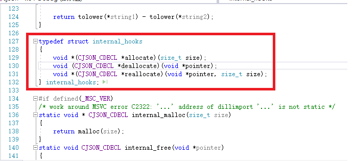
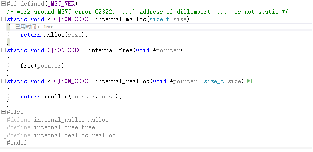
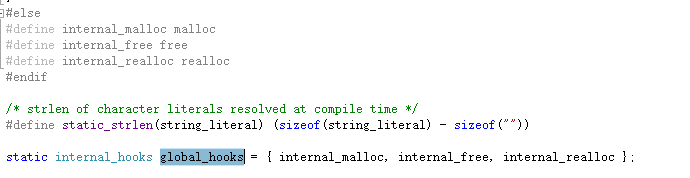

# 涉及的基础知识
## volatile 关键字
一种类型修饰符，用它声明的类型变量表示可以被某些编译器未知的因素更改，比如：操作系统、硬件或者其它线程等。遇到这个关键字声明的变量，编译器对访问该变量的代码就不再进行优化，从而可以提供对特殊地址的稳定访问。声明时语法：int volatile vInt; 当要求使用 volatile 声明的变量的值的时候，系统总是重新从它所在的内存读取数据，即使它前面的指令刚刚从该处读取过数据。而且读取的数据立刻被保存。

[volatile关键字作用](https://www.cnblogs.com/yc_sunniwell/archive/2010/07/14/1777432.html)

## _MSC_VER
代表的是Visual studio的c++编译器的主版本和副版本号。可以通过这个标志来确定当前系统是Windows还是其它类型系统。

## pragma
用于设定编译器的状态或者是指示编译器完成一些特定的动作
#### 1、pragma once：

这是一个比较常用的指令,只要在头文件的最开始加入这条指令就能够保证头文件被编译一次，避免文件被重复包含。
#### 2、pragma comment：
 该指令的格式：#pragma comment( comment-type [,"commentstring"] )

该指令将一个注释记录放入一个对象文件或可执行文件中。
- comment-type(注释类型):可以指定为五种预定义的标识符的其中一种。
- commentstring是一个提供为comment-type提供附加信息的字符串，

comment-type类型：

- **compiler**: 将编译器的版本号和名称放入目标文件中,本条注释记录将被编译器忽略。如果你为该记录类型提供了commentstring参数,编译器将会产生一个警告。例如:#pragma comment( compiler )  
- **exestr**：将commentstring参数放入目标文件中,在链接的时候这个字符串将被放入到可执行文件中。当操作系统加载可执行文件的时候,该参数字符串不会被加载到内存中.但是,该字符串可以被dumpbin之类的程序查找出并打印出来,你可以用这个标识符将版本号码之类 的信息嵌入到可执行文件中!

# cjson风格
### 1、将一些常用操作（同一模式下的操作，例如内存管理等）封装到结构体中
如下所示，定义一个内部调用的hooks结构体，结构体中保存了3个关于内存分配（分配内存，释放内存，重新分配内存）的方法，allocate，deallocate和reallocate。同时针对不同的操作系统环境，分配内存的方式不一样。这3个钩子函数会对应到实际的内部内存分配函数上。而后续调用这个函数基本使用全局的结构体进行调用。

