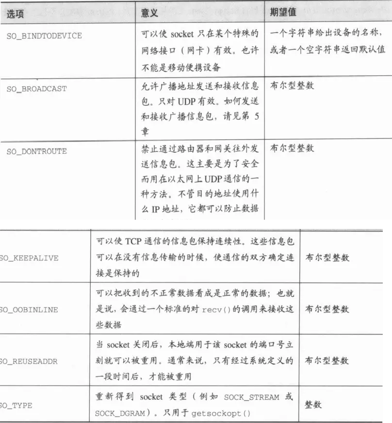
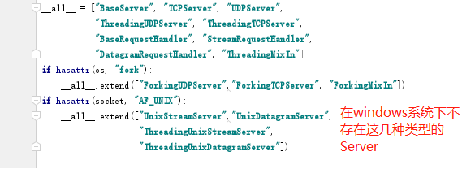
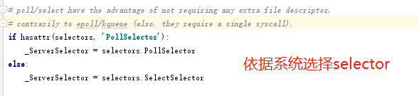

# 基础模块
## selectors模块
I/O多路复用指：通过一种机制，可以监视多个描述符(socket)，一旦某个描述符就绪（一般是读就绪或者写就绪），能够通知程序进行相应的读写操作。原本为多进程或多线程来接收多个连接的消息变为单进程或单线程保存多个socket的状态后轮询处理。  
实现IO多路复用机制（提供high-level api），根据平台选出最佳IO多路复用机制，windows为select，Linux为epoll （共三种模式 select， epoll 和 poll）。  
selectors模块提供的API是基于事件的。selectors对象提供socket要处理的事件，然后让调用者等待事件的触发。注册一个事件会产生一个Selectorkey，该key包含socket信息，事件信息以及可选的应用数据。selector调用起select方法会得到事件反馈，该反馈包含一系列的key对象和一个二进制串用于指示哪些事件发生，因此使用selector的程序必须不断地调用select方法，然后处理相应的事件。


- select（windows系统使用）   
1、每次调用都要将所有的文件描述符（fd）拷贝的内核空间，导致效率下降  
2、遍历所有的文件描述符（fd）查看是否有数据访问  
3、最大链接数限额（1024）

- epoll（Linux系统使用）：涉及3个函数  
1、第一个函数是创建一个epoll句柄，将所有的描述符（fd）拷贝到内核空间，但只拷贝一次。  
2、回调函数，某一个函数或某一个动作成功完成之后会触发的函数为所有的描述符（fd）绑定一个回调函数，一旦有数据访问就触发该回调函数，回调函数将（fd）放到链表中  
3、第三个函数判断链表是否为空  
4、最大连接数没有限额

官方示例：下述示例中可以看出
```python

import selectors
import socket

sel = selectors.DefaultSelector()

def accept(sock, mask):
    conn, addr = sock.accept()  # Should be ready
    print('accepted', conn, 'from', addr)
    conn.setblocking(False)
    sel.register(conn, selectors.EVENT_READ, read) # 将这个conn文件对象注册到sel中，当触发对应的read事件时就调用read函数

def read(conn, mask):
    data = conn.recv(1000)  # Should be ready
    if data:
        print('echoing', repr(data), 'to', conn)
        conn.send(data)  # Hope it won't block
    else:
        print('closing', conn)
        sel.unregister(conn)
        conn.close()

sock = socket.socket()
sock.bind(('localhost', 1234))
sock.listen(100)
sock.setblocking(False)  # 保证不阻塞
sel.register(sock, selectors.EVENT_READ, accept) # 将这个sock文件对象注册到sel中，当触发对应的read事件时就调用accept函数

while True:
    events = sel.select()
    for key, mask in events:  
    # 一开始key对应的是sock对应的obj，随后当有连接连接到sock，则for循环会不断地去遍历socket得到的连接，实现不断轮询每个socket连接的效果。
    # 这是一个单线程的程序，利用sel保存所有的socket连接，同时不断地去轮询socket连接对象，实现对多个socket连接的处理 
        callback = key.data
        callback(key.fileobj, mask)
```

selectors的select方法：

abstractmethod select(timeout=None)
Wait until some registered file objects become ready, or the timeout expires.等待某个注册的文件对象准备好，或者超时报错。

If timeout > 0, this specifies the maximum wait time, in seconds. If timeout <= 0, the call won’t block, and will report the currently ready file objects. If timeout is None, the call will block until a monitored file object becomes ready. 超时时间设置为>0，表示最大等待时间; <= 0 表示无等待，直接返回当前已准备好的文件对象，None则表示等待到有文件对象准备好位置

This returns a list of (key, events) tuples, one for each ready file object. 返回值是一个(key,event)的tuple 列表，保存已经准备好的文件对象

key is the SelectorKey instance corresponding to a ready file object. events is a bitmask of events ready on this file object.

## threading模块（event部分）

通过threading.Event()可以创建一个事件管理标志，该标志（event）默认为False，event对象主要有四种方法可以调用：

- event.wait(timeout=None)：调用该方法的线程会被阻塞，如果设置了timeout参数，超时后，线程会停止阻塞继续执行；
- event.set()：将event的标志设置为True，调用wait方法的所有线程将被唤醒；
- event.clear()：将event的标志设置为False，调用wait方法的所有线程将被阻塞；
- event.isSet()：判断event的标志是否为True。

## socket模块
#### 1、SO_REUSEADDR选项：
通常一个服务器进程终止后，操作系统会保留几分钟它的端口，从而防止其他进程在超时之前使用这个端口。如果设置SO_REUSEADDR为true，操作系统就会在服务器socket被关闭或服务器终止后马上释放该服务器的端口。

#### 2、setsockopt(level,optname,value) 和 getsockopt(level,optname,buflen)
value参数的内容是由level和optname决定的。level定义了哪个选项将被使用。通常情况下是SOL_SOCKET。意思是正在使用socket选项。还可以通过设置一个特殊协议号码来设置协议选项。SOL_SOCKET的常用选项如下



  


# 源码解析




  
整个代码的框架大致如下：socket_server中包含了几个Server的定义，以及Handler 还有 Mixin。

一般我们使用定义对应的Handler，然后选择合适的Server并对Server加入合适的Mixin来实现多线程并发Socket服务。
```
+------------+
| BaseServer |
+------------+
        |
        v
+-----------+        +------------------+
| TCPServer |------->| UnixStreamServer |
+-----------+        +------------------+
        |
        v
+-----------+        +--------------------+
| UDPServer |------->| UnixDatagramServer |
+-----------+        +--------------------+
```

### BaseServer
全部Server的基类，抽象了各个TCPServer和UDPServer都会使用的操作方法，正式使用中并不会调用到这个类，而是调用其子类（观察代码可以发现其中缺失一些变量，而这些变量都在子类中声明）


