# 软件测试的原则
1、测试应该尽早介入  
2、所有的测试都应该追溯到客户的需求  
3、协助开发人员发现开发代码中的问题  
4、二八原则 - 测试发现的错误中80%可能来源于20%的模块中  
5、对错误结果要进行一个确认过程  
6、 测试用例设计必须考虑到合法和非法的输入和各种边界条件，特殊情况下还要制造极端状态和意外状态  
7、指定严格的测试计划  
8、不可能有完全的测试  
9、妥善保存好测试过程中的所有文档

# 分类
测试执行阶段分：
- 单元测试
- 集成测试
    模块集成进行测试
- 系统测试
- 验收测试（正式验证测试、alpha测试，beta测试）  
    alpha测试- 用户在开发环境下测试，开发人员会从旁协助；beta测试在实际使用（上线）情况下进行测试，会对使用中收到的问题进行反馈。  

- 测试技术划分 
    - 黑盒测试  
        功能性测试，仅对功能、外观是否符合要求进行测试。
    - 白盒测试
        检查程序的内部结构并进行测试。
    - 灰盒测试
        介于白盒和黑盒之间。开放部分代码进行测试。
- 测试对象是否运行划分
    - 动态测试
    - 静态测试（文档检查，代码走查，界面检查）

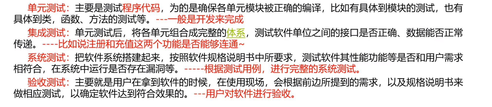

测试手段划分
- 手工测试
- 自动化测试，开发自动化测试工具并进行测试

# 软件生命周期和软件测试流程
- 开始研制到最终废弃的各个阶段 - 软件生命周期
- 生命周期模型 - 瀑布模型，V模型，敏捷开发模型
## 生命周期模型
1. 瀑布模型（自上而下）
    - 问题定义和规划（市场调研）->需求分析（产品经理开会进行需求的描述等）->设计（模块的分析和设计）->编码->测试->运行维护

2. V模型  
    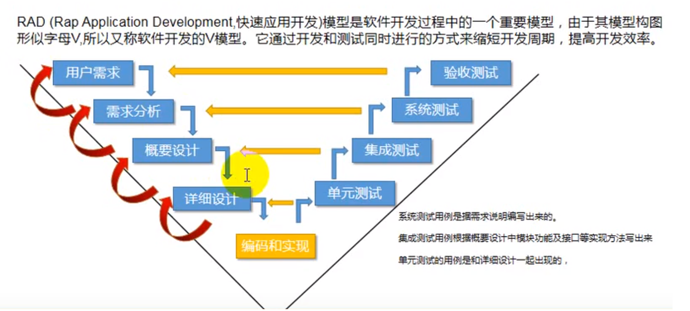
    在完成某项设计、分析或者编码工作的同时就进行测试。  

3. 敏捷开发模型
    以人为核心，迭代，循序渐进的开发方法，强调以人为本，专注于交付客户有价值的软件。用于开发和维持复杂产品的框架，即将一个大项目分为多个互相联系，但也可独立运行的小项目，并分别完成，在此过程中软件一直处于可使用状态。  
    迭代快

# 软件测试的工作流程
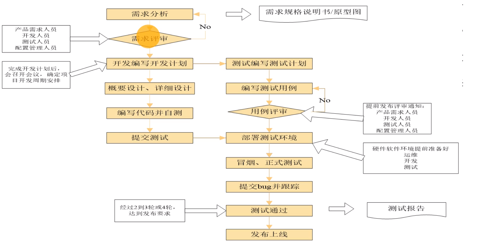
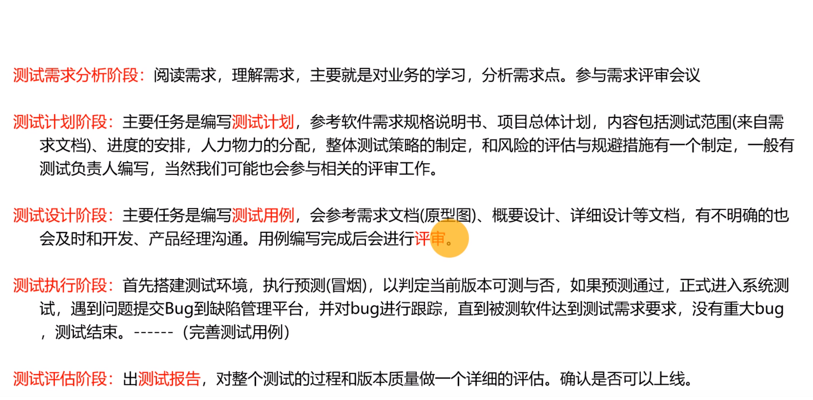
概要设计和详细设计  
把需求分析得到的结果转换为软件结构和数据结构，形成系统架构  
概要设计：主要是架构的实现，指搭建架构，表述各模块功能、模块接口连接和数据床底的实现等事务  
详细设计：对概要设计中表述的各模块进行深入分析等，其中需要包含数据库设计说明等

冒烟测试 —— 主流程走通

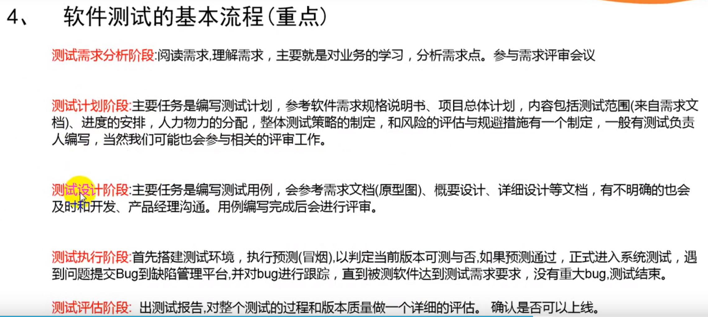

工作流程：  
需求评审 - 测试计划 - 测试用例 - 搭建测试环境 - 提交测试包进行测试 - 部署测试包 - 冒烟测试（流程测试） - 执行测试用例 - bug跟踪和处理（提交和回归bug） - N轮测试 - 版本上线，面向用户使用
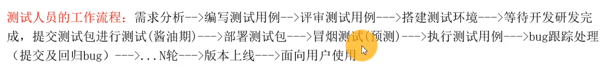

# 测试用例设计方法

## 等价类划分法：
黑盒测试方法，指某个输入域的子集合，在该子集合中，所有的输入数据对于揭露软件中的错误都是等效的   

等价类划分为 有效等价类 和 无效等价类

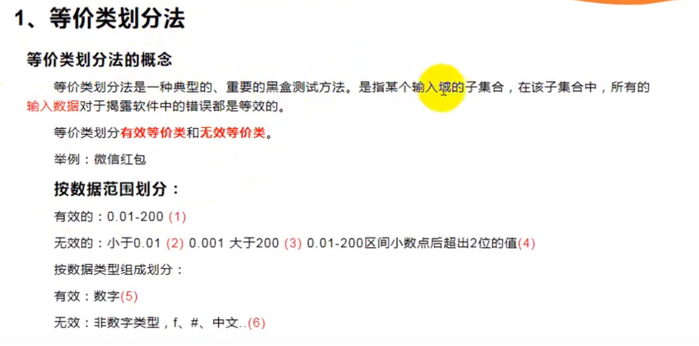

如何设计
- 划分有效及无效等价类，为每个等价类规定一个唯一的编号
- 设计一个新的测试用例数据，使其尽可能多地覆盖尚未被覆盖的有效等价类，重复该步，直到所有的有效等价类都被覆盖为止；只要有效等价类被覆盖，测试用例写的越少越好（一般要纳入临界值，特殊值）
- 设计一个新的测试用例数据，使其仅覆盖一个尚未被覆盖的无效等价类，重复该步知道所有的无效等价类都被覆盖为止，**每个无效等价类都是一条用例**；

## 边界值分析法
是等价类划分法的补充，边界值一般在等价类的边缘值进行寻找，边界值分析的基本思想：**正好等于，刚刚大于，刚刚小于边界值等**

## 场景法
通过场景描述的业务流程（逻辑，正常流程，异常流程），也包括代码实现逻辑，设计用例来遍历场景（路径），验证软件系统功能的正确性

流程图设计（矩形 表示步骤， 菱形 表示判断），通过流程图来描述测试流程，每个流程都用一个用例来验证，只是用于测试流程是否准确，后续每个功能点还需要通过详细的功能测试才算充分测试。

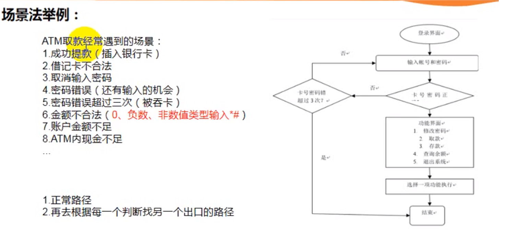

## 错误推测法（反推法）
基于经验，知识和直觉设计测试用例

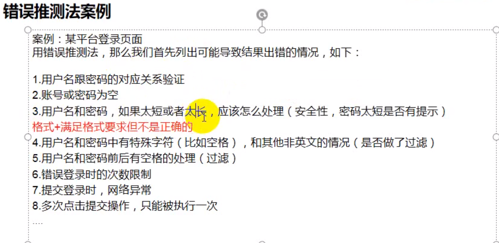

## 测试用例方法选择

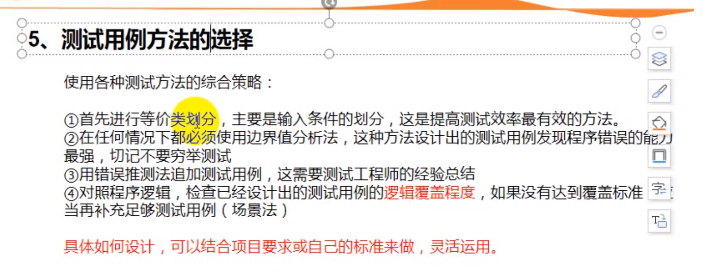

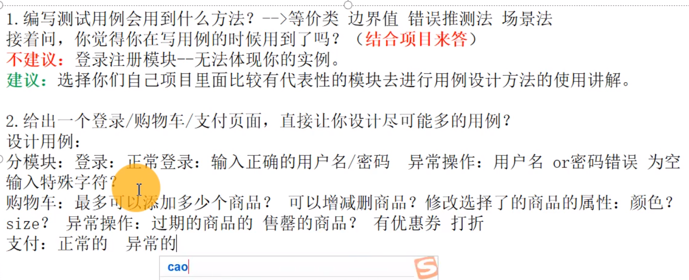

验证三角形是否为正常三角形，等腰三角形，等边三角形，直角三角形等：  
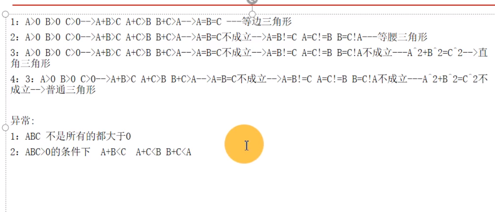
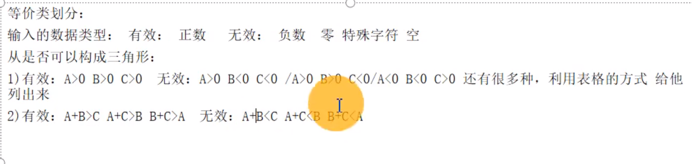

# 软件需求分析和软件用例编写
- 测什么 - 怎么测 - 什么时候开始测

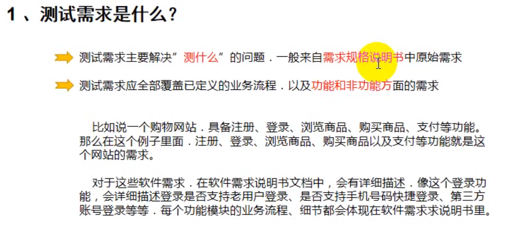

需求分析的主要目的：
- 依据需求文档提取测试点，根据测试点编写测试用例
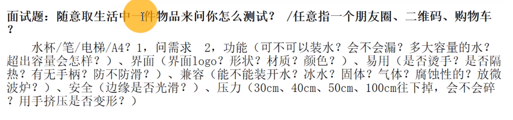
## 测试点（例如登录框测试的输入位置等）分析
在做需求分析的时候进行罗列，以便梳理清楚所有需要测试的功能点，一般可以使用xmind制作思维导图进行分析制作。   
- 正反面测试思维
    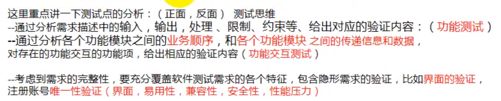
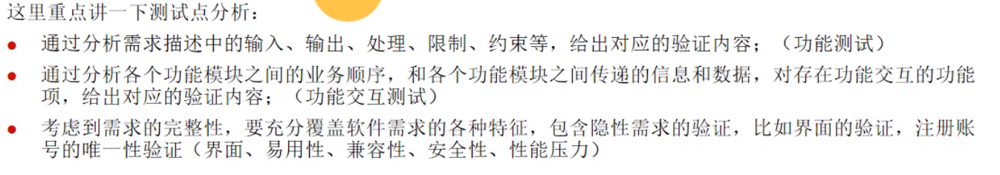
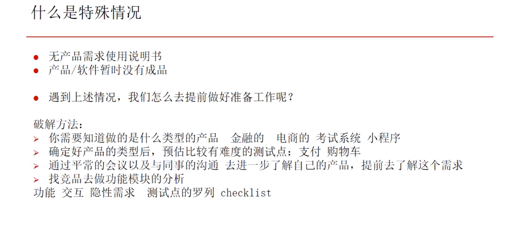

# 如何编写软件测试用例
为项目需求而编制的一组测试输入、执行条件以及预期结果，以便测试某个程序是否满足客户需求   
总结为 每一个测试点的数据设计和步骤设计。

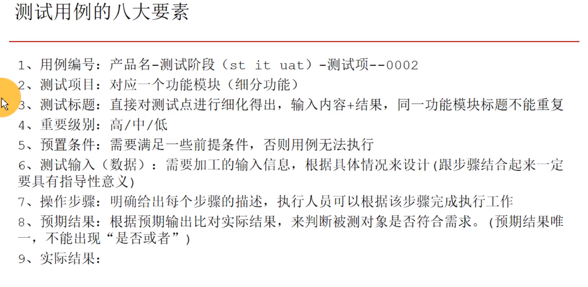

测试搜索功能例子
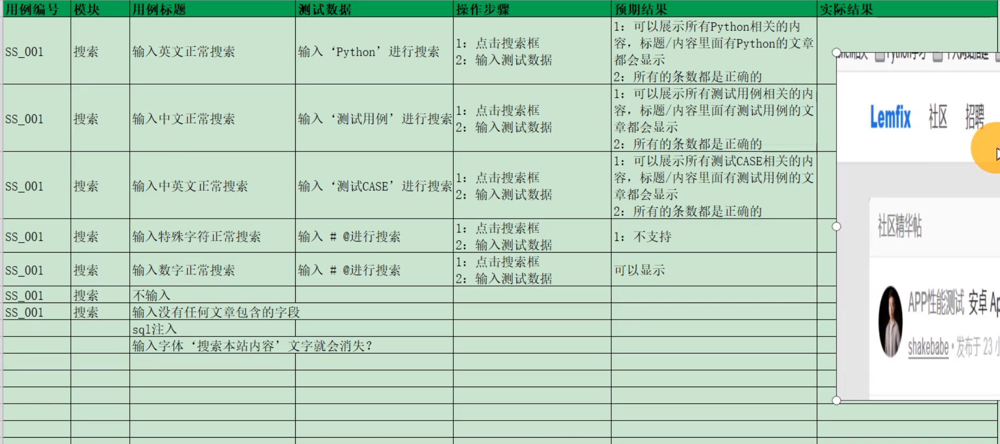
除了上述的功能测试外，还需要考虑隐性功能，例如外观，操作方便程度等测试

# bug管理
bug - 跟用户需求，要求，预期结果不一致的所有情况都称为bug  
bug生命周期：

